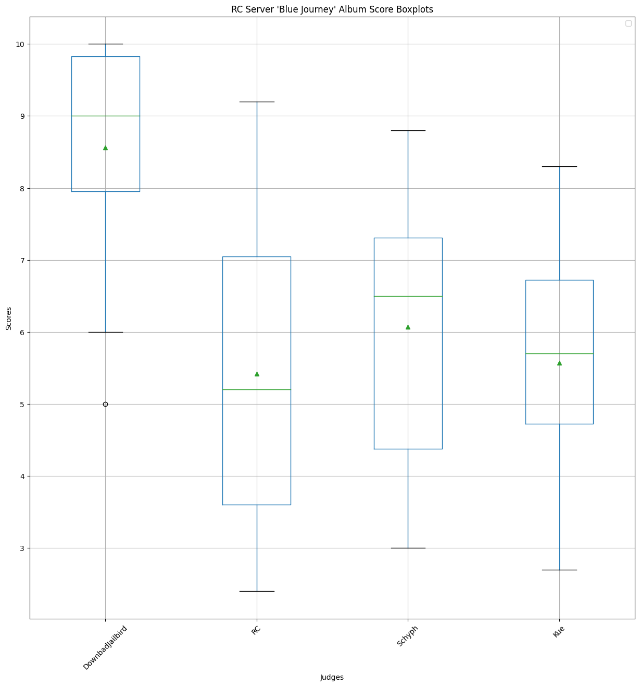
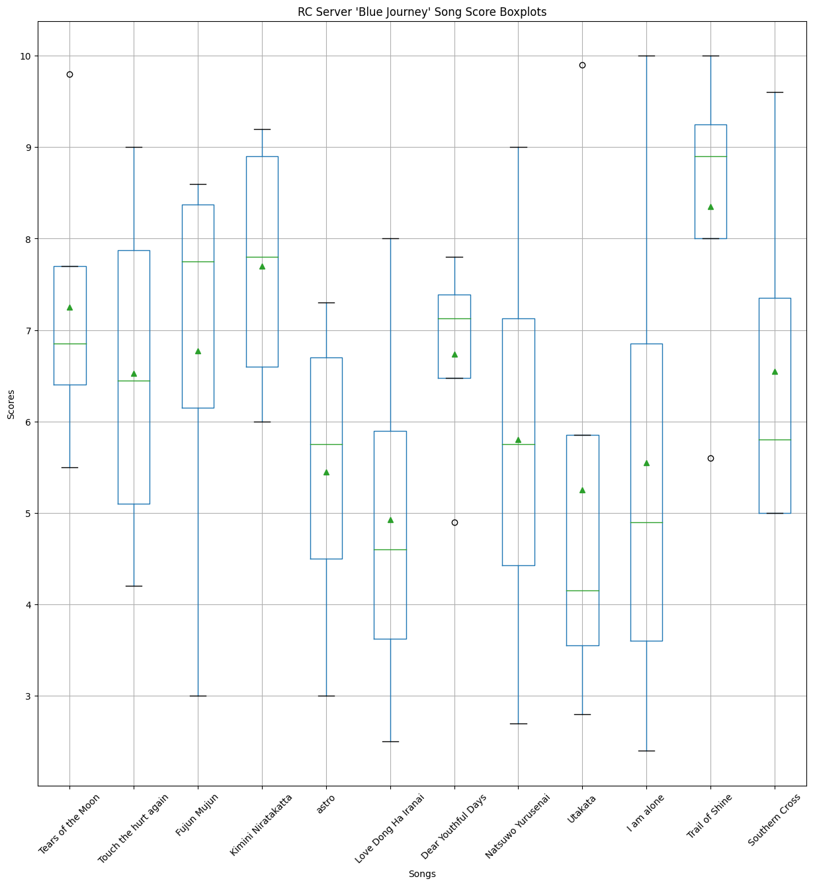
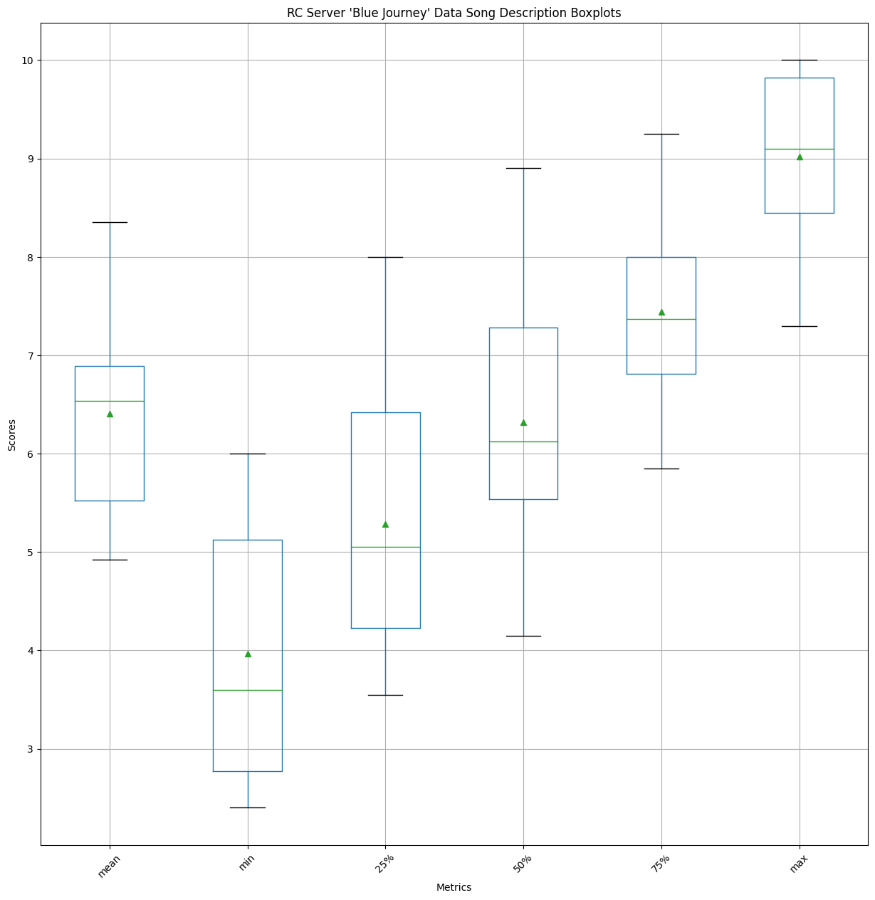
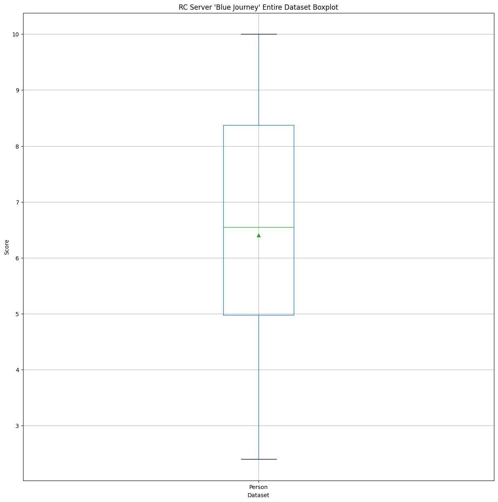
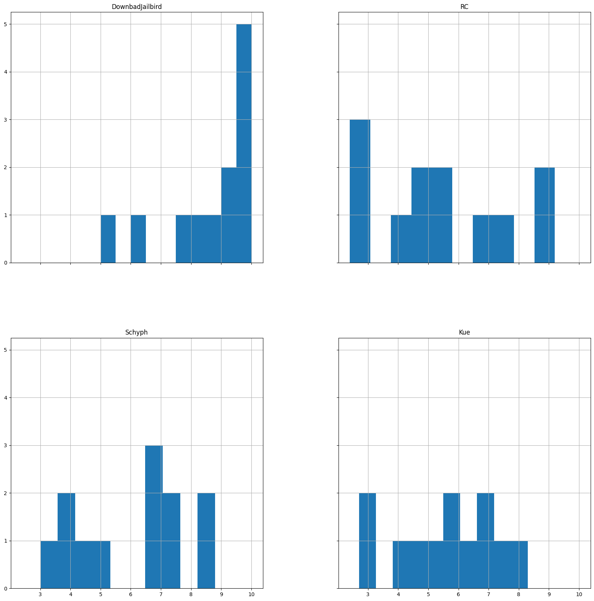
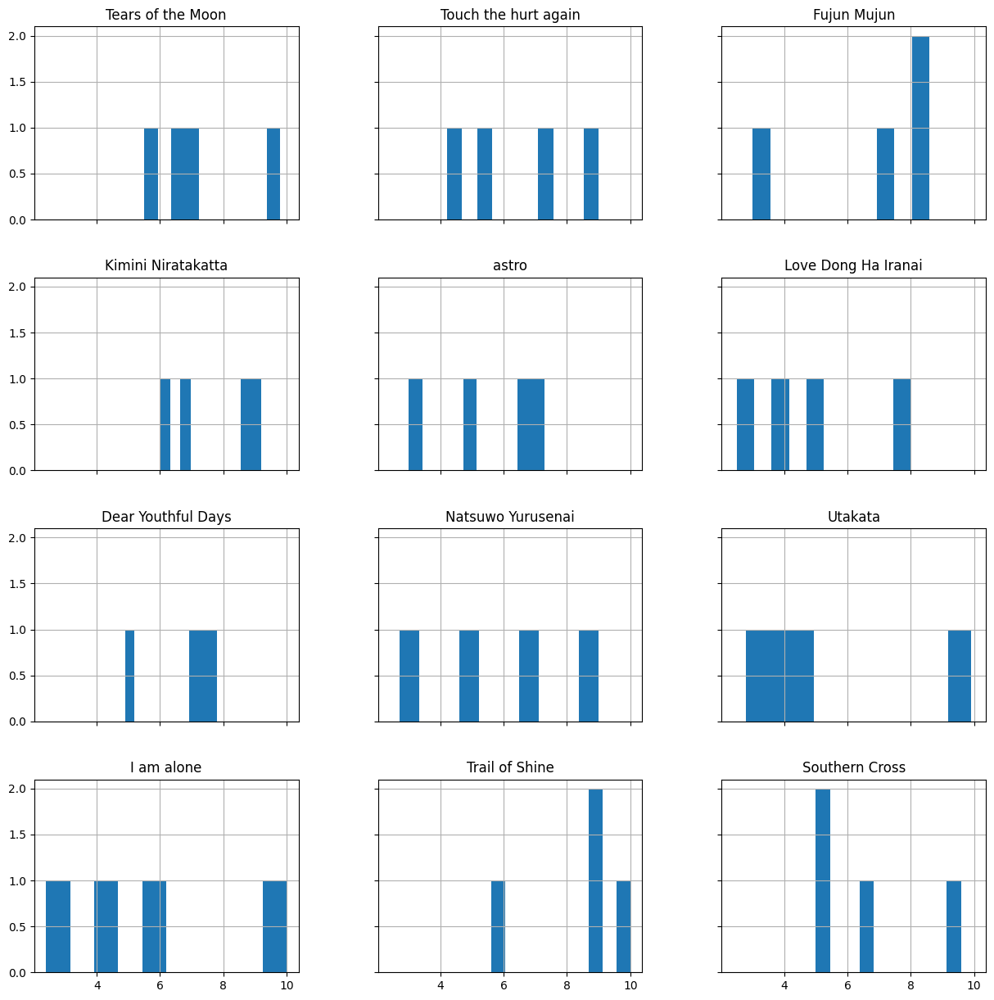
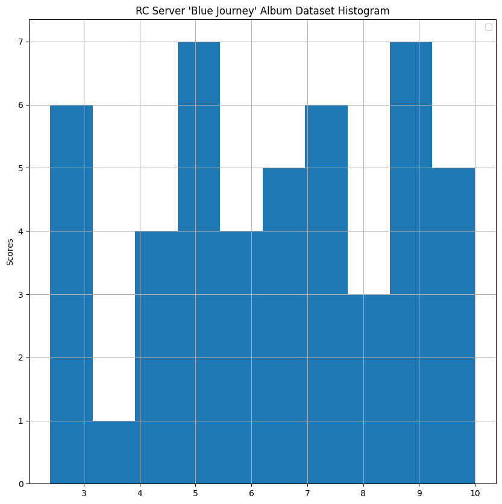

# Blue Journey
Results for Blue Journey!

I don't think I've heard a single one of these lol

# Raw Scores

<table border="1" class="dataframe">
  <thead>
    <tr style="text-align: right;">
      <th></th>
      <th>DownbadJailbird</th>
      <th>RC</th>
      <th>Schyph</th>
      <th>Kue</th>
    </tr>
    <tr>
      <th>Song</th>
      <th></th>
      <th></th>
      <th></th>
      <th></th>
    </tr>
  </thead>
  <tbody>
    <tr>
      <th>Tears of the Moon</th>
      <td>9.80</td>
      <td>5.50</td>
      <td>7.00</td>
      <td>6.70</td>
    </tr>
    <tr>
      <th>Touch the hurt again</th>
      <td>9.00</td>
      <td>5.40</td>
      <td>7.50</td>
      <td>4.20</td>
    </tr>
    <tr>
      <th>Fujun Mujun</th>
      <td>8.60</td>
      <td>7.20</td>
      <td>3.00</td>
      <td>8.30</td>
    </tr>
    <tr>
      <th>Kimini Niratakatta</th>
      <td>6.00</td>
      <td>9.20</td>
      <td>8.80</td>
      <td>6.80</td>
    </tr>
    <tr>
      <th>astro</th>
      <td>5.00</td>
      <td>3.00</td>
      <td>6.50</td>
      <td>7.30</td>
    </tr>
    <tr>
      <th>Love Dong Ha Iranai</th>
      <td>8.00</td>
      <td>2.50</td>
      <td>4.00</td>
      <td>5.20</td>
    </tr>
    <tr>
      <th>Dear Youthful Days</th>
      <td>7.80</td>
      <td>7.00</td>
      <td>7.25</td>
      <td>4.90</td>
    </tr>
    <tr>
      <th>Natsuwo Yurusenai</th>
      <td>9.00</td>
      <td>5.00</td>
      <td>6.50</td>
      <td>2.70</td>
    </tr>
    <tr>
      <th>Utakata</th>
      <td>9.90</td>
      <td>3.80</td>
      <td>4.50</td>
      <td>2.80</td>
    </tr>
    <tr>
      <th>I am alone</th>
      <td>10.00</td>
      <td>2.40</td>
      <td>4.00</td>
      <td>5.80</td>
    </tr>
    <tr>
      <th>Trail of Shine</th>
      <td>10.00</td>
      <td>9.00</td>
      <td>8.80</td>
      <td>5.60</td>
    </tr>
    <tr>
      <th>Southern Cross</th>
      <td>9.60</td>
      <td>5.00</td>
      <td>5.00</td>
      <td>6.60</td>
    </tr>
  </tbody>
</table>

# Data Description
## Person-wise

<table border="1" class="dataframe">
  <thead>
    <tr style="text-align: right;">
      <th></th>
      <th>DownbadJailbird</th>
      <th>RC</th>
      <th>Schyph</th>
      <th>Kue</th>
    </tr>
  </thead>
  <tbody>
    <tr>
      <th>count</th>
      <td>12.00</td>
      <td>12.00</td>
      <td>12.00</td>
      <td>12.00</td>
    </tr>
    <tr>
      <th>mean</th>
      <td>8.56</td>
      <td>5.42</td>
      <td>6.07</td>
      <td>5.57</td>
    </tr>
    <tr>
      <th>std</th>
      <td>1.63</td>
      <td>2.32</td>
      <td>1.93</td>
      <td>1.72</td>
    </tr>
    <tr>
      <th>min</th>
      <td>5.00</td>
      <td>2.40</td>
      <td>3.00</td>
      <td>2.70</td>
    </tr>
    <tr>
      <th>25%</th>
      <td>7.95</td>
      <td>3.60</td>
      <td>4.38</td>
      <td>4.73</td>
    </tr>
    <tr>
      <th>50%</th>
      <td>9.00</td>
      <td>5.20</td>
      <td>6.50</td>
      <td>5.70</td>
    </tr>
    <tr>
      <th>75%</th>
      <td>9.83</td>
      <td>7.05</td>
      <td>7.31</td>
      <td>6.72</td>
    </tr>
    <tr>
      <th>max</th>
      <td>10.00</td>
      <td>9.20</td>
      <td>8.80</td>
      <td>8.30</td>
    </tr>
  </tbody>
</table>

## Song-wise

<table border="1" class="dataframe">
  <thead>
    <tr style="text-align: right;">
      <th>Song</th>
      <th>Tears of the Moon</th>
      <th>Touch the hurt again</th>
      <th>Fujun Mujun</th>
      <th>Kimini Niratakatta</th>
      <th>astro</th>
      <th>Love Dong Ha Iranai</th>
      <th>Dear Youthful Days</th>
      <th>Natsuwo Yurusenai</th>
      <th>Utakata</th>
      <th>I am alone</th>
      <th>Trail of Shine</th>
      <th>Southern Cross</th>
    </tr>
  </thead>
  <tbody>
    <tr>
      <th>count</th>
      <td>4.00</td>
      <td>4.00</td>
      <td>4.00</td>
      <td>4.00</td>
      <td>4.00</td>
      <td>4.00</td>
      <td>4.00</td>
      <td>4.00</td>
      <td>4.00</td>
      <td>4.00</td>
      <td>4.00</td>
      <td>4.00</td>
    </tr>
    <tr>
      <th>mean</th>
      <td>7.25</td>
      <td>6.52</td>
      <td>6.78</td>
      <td>7.70</td>
      <td>5.45</td>
      <td>4.92</td>
      <td>6.74</td>
      <td>5.80</td>
      <td>5.25</td>
      <td>5.55</td>
      <td>8.35</td>
      <td>6.55</td>
    </tr>
    <tr>
      <th>std</th>
      <td>1.82</td>
      <td>2.14</td>
      <td>2.59</td>
      <td>1.54</td>
      <td>1.89</td>
      <td>2.33</td>
      <td>1.27</td>
      <td>2.64</td>
      <td>3.18</td>
      <td>3.28</td>
      <td>1.91</td>
      <td>2.17</td>
    </tr>
    <tr>
      <th>min</th>
      <td>5.50</td>
      <td>4.20</td>
      <td>3.00</td>
      <td>6.00</td>
      <td>3.00</td>
      <td>2.50</td>
      <td>4.90</td>
      <td>2.70</td>
      <td>2.80</td>
      <td>2.40</td>
      <td>5.60</td>
      <td>5.00</td>
    </tr>
    <tr>
      <th>25%</th>
      <td>6.40</td>
      <td>5.10</td>
      <td>6.15</td>
      <td>6.60</td>
      <td>4.50</td>
      <td>3.62</td>
      <td>6.47</td>
      <td>4.42</td>
      <td>3.55</td>
      <td>3.60</td>
      <td>8.00</td>
      <td>5.00</td>
    </tr>
    <tr>
      <th>50%</th>
      <td>6.85</td>
      <td>6.45</td>
      <td>7.75</td>
      <td>7.80</td>
      <td>5.75</td>
      <td>4.60</td>
      <td>7.12</td>
      <td>5.75</td>
      <td>4.15</td>
      <td>4.90</td>
      <td>8.90</td>
      <td>5.80</td>
    </tr>
    <tr>
      <th>75%</th>
      <td>7.70</td>
      <td>7.88</td>
      <td>8.38</td>
      <td>8.90</td>
      <td>6.70</td>
      <td>5.90</td>
      <td>7.39</td>
      <td>7.12</td>
      <td>5.85</td>
      <td>6.85</td>
      <td>9.25</td>
      <td>7.35</td>
    </tr>
    <tr>
      <th>max</th>
      <td>9.80</td>
      <td>9.00</td>
      <td>8.60</td>
      <td>9.20</td>
      <td>7.30</td>
      <td>8.00</td>
      <td>7.80</td>
      <td>9.00</td>
      <td>9.90</td>
      <td>10.00</td>
      <td>10.00</td>
      <td>9.60</td>
    </tr>
  </tbody>
</table>

## Entire dataset

<table border="1" class="dataframe">
  <thead>
    <tr style="text-align: right;">
      <th></th>
      <th>Person</th>
    </tr>
  </thead>
  <tbody>
    <tr>
      <th>count</th>
      <td>48.00</td>
    </tr>
    <tr>
      <th>mean</th>
      <td>6.41</td>
    </tr>
    <tr>
      <th>std</th>
      <td>2.26</td>
    </tr>
    <tr>
      <th>min</th>
      <td>2.40</td>
    </tr>
    <tr>
      <th>25%</th>
      <td>4.97</td>
    </tr>
    <tr>
      <th>50%</th>
      <td>6.55</td>
    </tr>
    <tr>
      <th>75%</th>
      <td>8.38</td>
    </tr>
    <tr>
      <th>max</th>
      <td>10.00</td>
    </tr>
  </tbody>
</table>

# Boxplots

## Person-wise

## Song-wise

## Entire dataset

# Histograms

## Person-wise

## Song-wise

## Entire dataset
