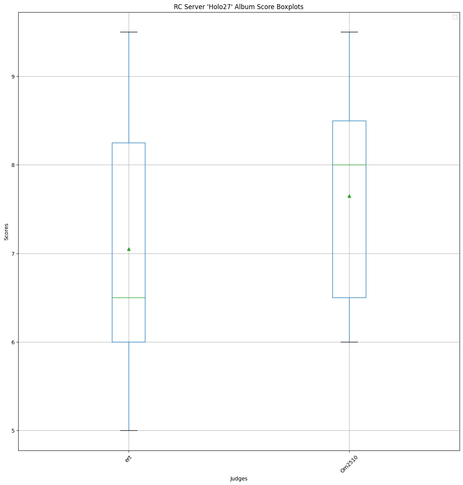
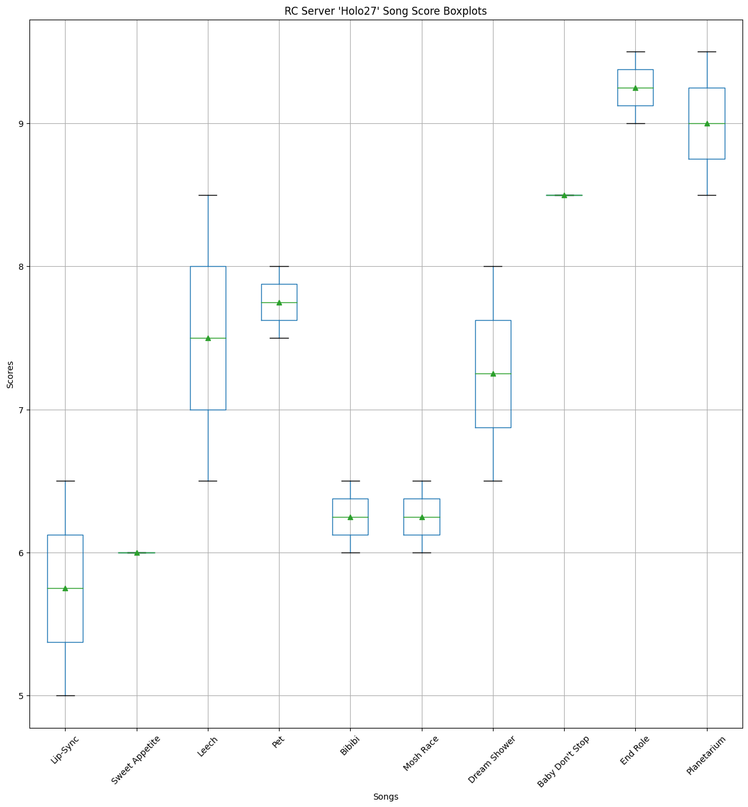
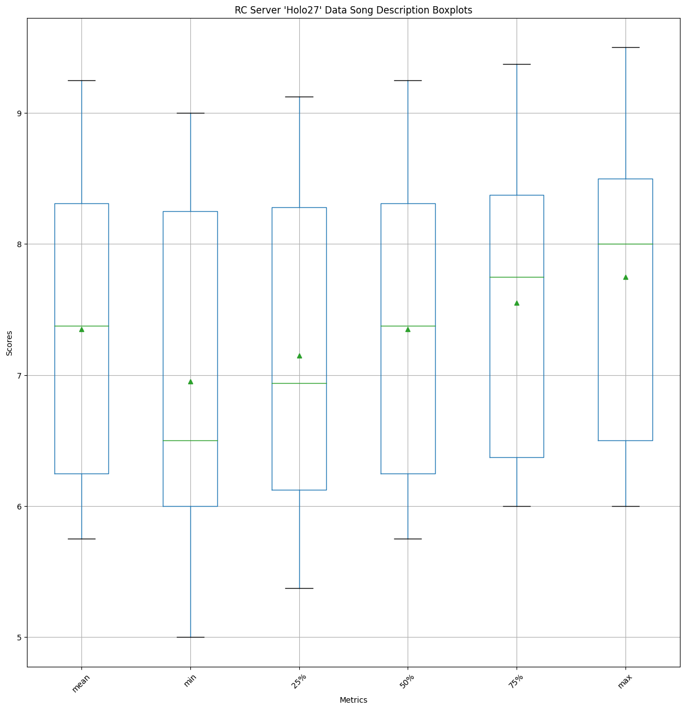
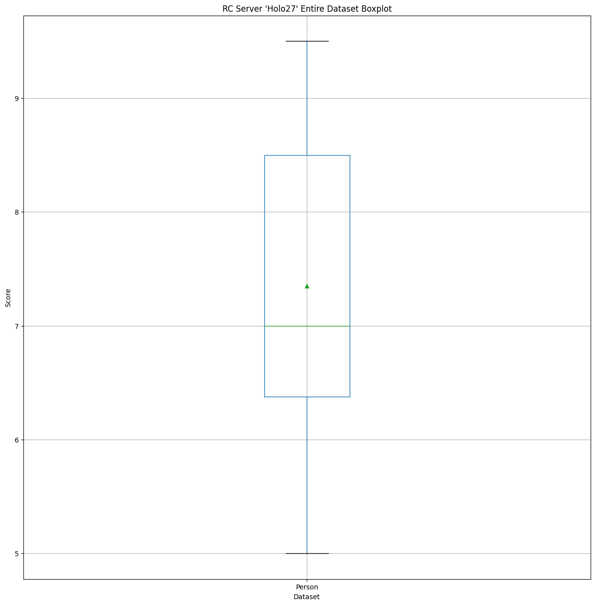
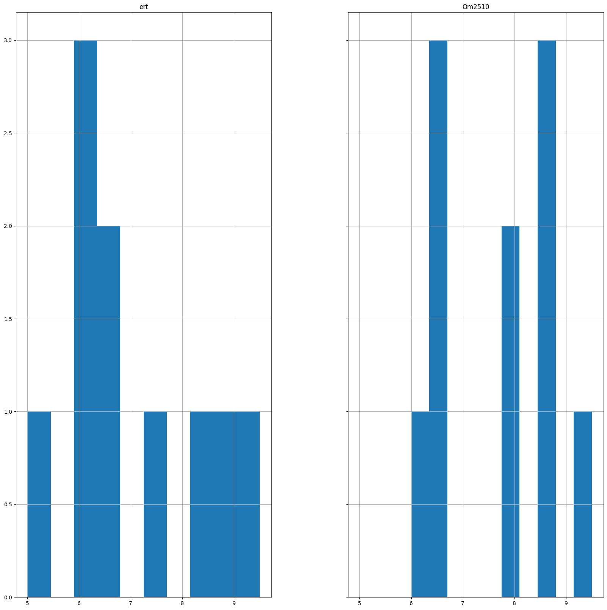
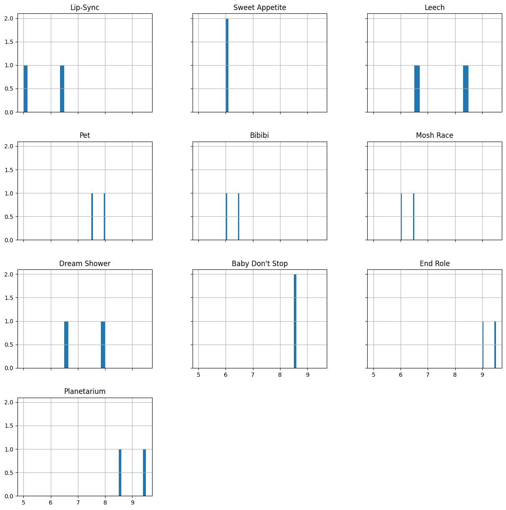
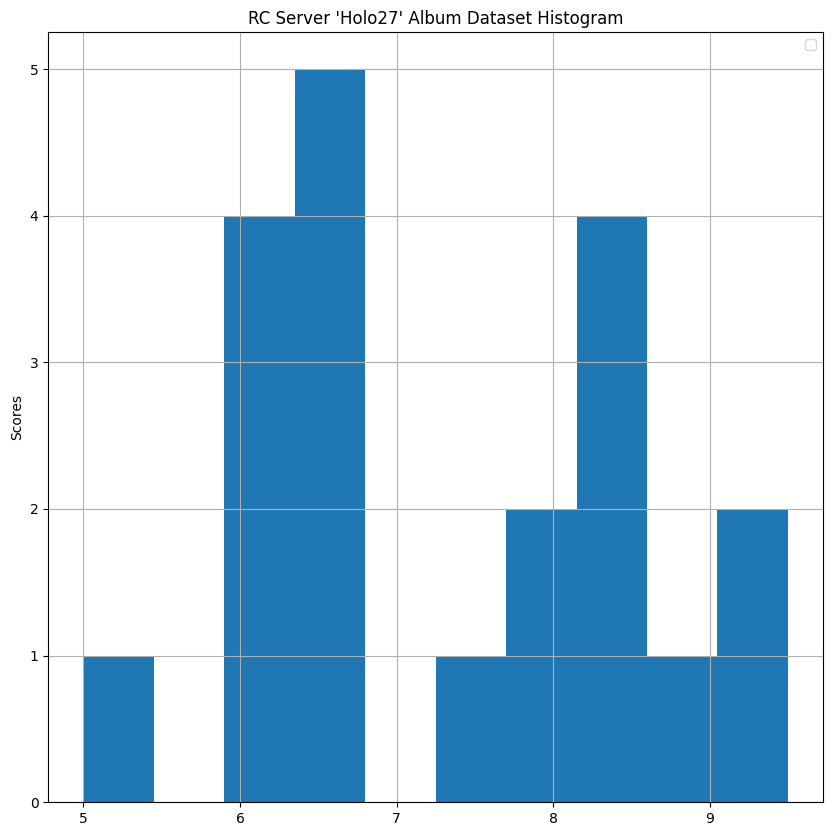

# Holo27
Results for holo27!

Started the thread for this back in march 2023.
I still haven't rated this one myself. From the holo27 concert, I only liked chloe and ayame's songs though, so I prob won't

# Raw Scores

<table border="1" class="dataframe">
  <thead>
    <tr style="text-align: right;">
      <th></th>
      <th>ert</th>
      <th>Om2510</th>
    </tr>
    <tr>
      <th>Song</th>
      <th></th>
      <th></th>
    </tr>
  </thead>
  <tbody>
    <tr>
      <th>Lip-Sync</th>
      <td>5.00</td>
      <td>6.50</td>
    </tr>
    <tr>
      <th>Sweet Appetite</th>
      <td>6.00</td>
      <td>6.00</td>
    </tr>
    <tr>
      <th>Leech</th>
      <td>6.50</td>
      <td>8.50</td>
    </tr>
    <tr>
      <th>Pet</th>
      <td>7.50</td>
      <td>8.00</td>
    </tr>
    <tr>
      <th>Bibibi</th>
      <td>6.00</td>
      <td>6.50</td>
    </tr>
    <tr>
      <th>Mosh Race</th>
      <td>6.00</td>
      <td>6.50</td>
    </tr>
    <tr>
      <th>Dream Shower</th>
      <td>6.50</td>
      <td>8.00</td>
    </tr>
    <tr>
      <th>Baby Don't Stop</th>
      <td>8.50</td>
      <td>8.50</td>
    </tr>
    <tr>
      <th>End Role</th>
      <td>9.00</td>
      <td>9.50</td>
    </tr>
    <tr>
      <th>Planetarium</th>
      <td>9.50</td>
      <td>8.50</td>
    </tr>
  </tbody>
</table>

# Data Description
## Person-wise

<table border="1" class="dataframe">
  <thead>
    <tr style="text-align: right;">
      <th></th>
      <th>ert</th>
      <th>Om2510</th>
    </tr>
  </thead>
  <tbody>
    <tr>
      <th>count</th>
      <td>10.00</td>
      <td>10.00</td>
    </tr>
    <tr>
      <th>mean</th>
      <td>7.05</td>
      <td>7.65</td>
    </tr>
    <tr>
      <th>std</th>
      <td>1.50</td>
      <td>1.18</td>
    </tr>
    <tr>
      <th>min</th>
      <td>5.00</td>
      <td>6.00</td>
    </tr>
    <tr>
      <th>25%</th>
      <td>6.00</td>
      <td>6.50</td>
    </tr>
    <tr>
      <th>50%</th>
      <td>6.50</td>
      <td>8.00</td>
    </tr>
    <tr>
      <th>75%</th>
      <td>8.25</td>
      <td>8.50</td>
    </tr>
    <tr>
      <th>max</th>
      <td>9.50</td>
      <td>9.50</td>
    </tr>
  </tbody>
</table>

## Song-wise

<table border="1" class="dataframe">
  <thead>
    <tr style="text-align: right;">
      <th>Song</th>
      <th>Lip-Sync</th>
      <th>Sweet Appetite</th>
      <th>Leech</th>
      <th>Pet</th>
      <th>Bibibi</th>
      <th>Mosh Race</th>
      <th>Dream Shower</th>
      <th>Baby Don't Stop</th>
      <th>End Role</th>
      <th>Planetarium</th>
    </tr>
  </thead>
  <tbody>
    <tr>
      <th>count</th>
      <td>2.00</td>
      <td>2.00</td>
      <td>2.00</td>
      <td>2.00</td>
      <td>2.00</td>
      <td>2.00</td>
      <td>2.00</td>
      <td>2.00</td>
      <td>2.00</td>
      <td>2.00</td>
    </tr>
    <tr>
      <th>mean</th>
      <td>5.75</td>
      <td>6.00</td>
      <td>7.50</td>
      <td>7.75</td>
      <td>6.25</td>
      <td>6.25</td>
      <td>7.25</td>
      <td>8.50</td>
      <td>9.25</td>
      <td>9.00</td>
    </tr>
    <tr>
      <th>std</th>
      <td>1.06</td>
      <td>0.00</td>
      <td>1.41</td>
      <td>0.35</td>
      <td>0.35</td>
      <td>0.35</td>
      <td>1.06</td>
      <td>0.00</td>
      <td>0.35</td>
      <td>0.71</td>
    </tr>
    <tr>
      <th>min</th>
      <td>5.00</td>
      <td>6.00</td>
      <td>6.50</td>
      <td>7.50</td>
      <td>6.00</td>
      <td>6.00</td>
      <td>6.50</td>
      <td>8.50</td>
      <td>9.00</td>
      <td>8.50</td>
    </tr>
    <tr>
      <th>25%</th>
      <td>5.38</td>
      <td>6.00</td>
      <td>7.00</td>
      <td>7.62</td>
      <td>6.12</td>
      <td>6.12</td>
      <td>6.88</td>
      <td>8.50</td>
      <td>9.12</td>
      <td>8.75</td>
    </tr>
    <tr>
      <th>50%</th>
      <td>5.75</td>
      <td>6.00</td>
      <td>7.50</td>
      <td>7.75</td>
      <td>6.25</td>
      <td>6.25</td>
      <td>7.25</td>
      <td>8.50</td>
      <td>9.25</td>
      <td>9.00</td>
    </tr>
    <tr>
      <th>75%</th>
      <td>6.12</td>
      <td>6.00</td>
      <td>8.00</td>
      <td>7.88</td>
      <td>6.38</td>
      <td>6.38</td>
      <td>7.62</td>
      <td>8.50</td>
      <td>9.38</td>
      <td>9.25</td>
    </tr>
    <tr>
      <th>max</th>
      <td>6.50</td>
      <td>6.00</td>
      <td>8.50</td>
      <td>8.00</td>
      <td>6.50</td>
      <td>6.50</td>
      <td>8.00</td>
      <td>8.50</td>
      <td>9.50</td>
      <td>9.50</td>
    </tr>
  </tbody>
</table>

## Entire dataset

<table border="1" class="dataframe">
  <thead>
    <tr style="text-align: right;">
      <th></th>
      <th>Person</th>
    </tr>
  </thead>
  <tbody>
    <tr>
      <th>count</th>
      <td>20.00</td>
    </tr>
    <tr>
      <th>mean</th>
      <td>7.35</td>
    </tr>
    <tr>
      <th>std</th>
      <td>1.35</td>
    </tr>
    <tr>
      <th>min</th>
      <td>5.00</td>
    </tr>
    <tr>
      <th>25%</th>
      <td>6.38</td>
    </tr>
    <tr>
      <th>50%</th>
      <td>7.00</td>
    </tr>
    <tr>
      <th>75%</th>
      <td>8.50</td>
    </tr>
    <tr>
      <th>max</th>
      <td>9.50</td>
    </tr>
  </tbody>
</table>

# Boxplots

## Person-wise

## Song-wise

## Entire dataset

# Histograms

## Person-wise

## Song-wise

## Entire dataset
