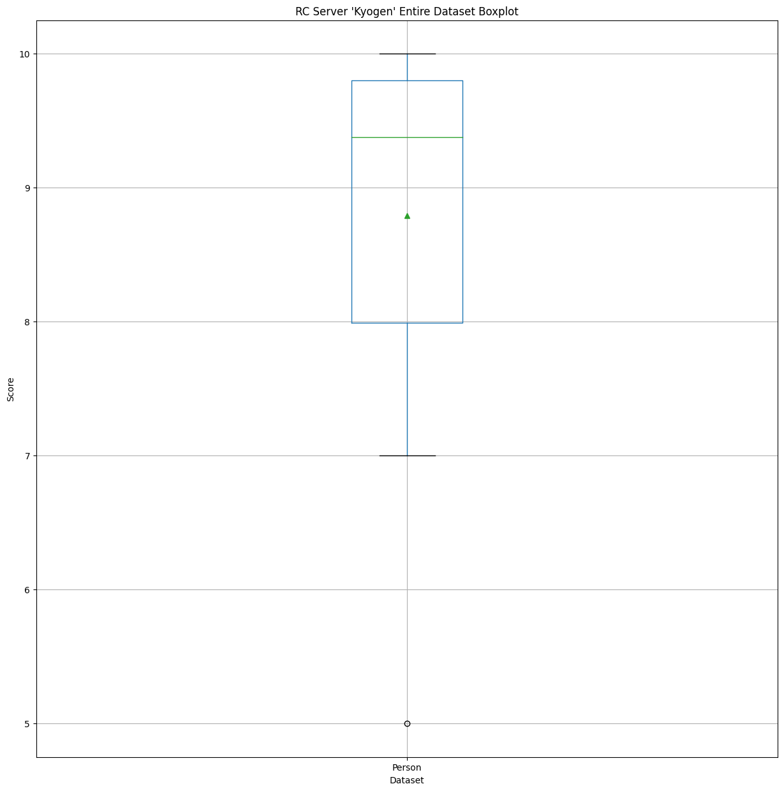

# Kyogen
Results for Kyogen!

The review stream for this was in March 2023 if you can believe it

# Raw Scores

<table border="1" class="dataframe">
  <thead>
    <tr style="text-align: right;">
      <th></th>
      <th>Tommy</th>
      <th>Kue</th>
      <th>Saph</th>
    </tr>
    <tr>
      <th>Song</th>
      <th></th>
      <th></th>
      <th></th>
    </tr>
  </thead>
  <tbody>
    <tr>
      <th>Readymade</th>
      <td>7.00</td>
      <td>9.10</td>
      <td>10.00</td>
    </tr>
    <tr>
      <th>Odo</th>
      <td>8.50</td>
      <td>9.80</td>
      <td>10.00</td>
    </tr>
    <tr>
      <th>Domestic De Violence</th>
      <td>7.00</td>
      <td>7.99</td>
      <td>9.00</td>
    </tr>
    <tr>
      <th>Freedom</th>
      <td>7.00</td>
      <td>9.56</td>
      <td>9.80</td>
    </tr>
    <tr>
      <th>Fireworks</th>
      <td>7.00</td>
      <td>9.30</td>
      <td>9.50</td>
    </tr>
    <tr>
      <th>Aitakute</th>
      <td>7.00</td>
      <td>9.90</td>
      <td>9.50</td>
    </tr>
    <tr>
      <th>Lucky Bruto</th>
      <td>5.00</td>
      <td>8.60</td>
      <td>10.00</td>
    </tr>
    <tr>
      <th>Gira Gira</th>
      <td>8.00</td>
      <td>9.70</td>
      <td>10.00</td>
    </tr>
    <tr>
      <th>Asura-chan</th>
      <td>8.00</td>
      <td>9.85</td>
      <td>10.00</td>
    </tr>
    <tr>
      <th>KokoroToluNanoFukakai</th>
      <td>8.00</td>
      <td>9.90</td>
      <td>9.50</td>
    </tr>
    <tr>
      <th>Usseewa</th>
      <td>7.50</td>
      <td>9.71</td>
      <td>10.00</td>
    </tr>
    <tr>
      <th>Motherland</th>
      <td>7.00</td>
      <td>9.45</td>
      <td>9.80</td>
    </tr>
    <tr>
      <th>Kagakashu</th>
      <td>7.90</td>
      <td>9.60</td>
      <td>9.00</td>
    </tr>
    <tr>
      <th>Yoru No Pierrot</th>
      <td>7.00</td>
      <td>9.00</td>
      <td>9.80</td>
    </tr>
  </tbody>
</table>

# Data Description
## Person-wise

<table border="1" class="dataframe">
  <thead>
    <tr style="text-align: right;">
      <th></th>
      <th>Tommy</th>
      <th>Kue</th>
      <th>Saph</th>
    </tr>
  </thead>
  <tbody>
    <tr>
      <th>count</th>
      <td>14.00</td>
      <td>14.00</td>
      <td>14.00</td>
    </tr>
    <tr>
      <th>mean</th>
      <td>7.28</td>
      <td>9.39</td>
      <td>9.71</td>
    </tr>
    <tr>
      <th>std</th>
      <td>0.84</td>
      <td>0.55</td>
      <td>0.36</td>
    </tr>
    <tr>
      <th>min</th>
      <td>5.00</td>
      <td>7.99</td>
      <td>9.00</td>
    </tr>
    <tr>
      <th>25%</th>
      <td>7.00</td>
      <td>9.15</td>
      <td>9.50</td>
    </tr>
    <tr>
      <th>50%</th>
      <td>7.00</td>
      <td>9.58</td>
      <td>9.80</td>
    </tr>
    <tr>
      <th>75%</th>
      <td>7.97</td>
      <td>9.78</td>
      <td>10.00</td>
    </tr>
    <tr>
      <th>max</th>
      <td>8.50</td>
      <td>9.90</td>
      <td>10.00</td>
    </tr>
  </tbody>
</table>

## Song-wise

<table border="1" class="dataframe">
  <thead>
    <tr style="text-align: right;">
      <th>Song</th>
      <th>Readymade</th>
      <th>Odo</th>
      <th>Domestic De Violence</th>
      <th>Freedom</th>
      <th>Fireworks</th>
      <th>Aitakute</th>
      <th>Lucky Bruto</th>
      <th>Gira Gira</th>
      <th>Asura-chan</th>
      <th>KokoroToluNanoFukakai</th>
      <th>Usseewa</th>
      <th>Motherland</th>
      <th>Kagakashu</th>
      <th>Yoru No Pierrot</th>
    </tr>
  </thead>
  <tbody>
    <tr>
      <th>count</th>
      <td>3.00</td>
      <td>3.00</td>
      <td>3.00</td>
      <td>3.00</td>
      <td>3.00</td>
      <td>3.00</td>
      <td>3.00</td>
      <td>3.00</td>
      <td>3.00</td>
      <td>3.00</td>
      <td>3.00</td>
      <td>3.00</td>
      <td>3.00</td>
      <td>3.00</td>
    </tr>
    <tr>
      <th>mean</th>
      <td>8.70</td>
      <td>9.43</td>
      <td>8.00</td>
      <td>8.79</td>
      <td>8.60</td>
      <td>8.80</td>
      <td>7.87</td>
      <td>9.23</td>
      <td>9.28</td>
      <td>9.13</td>
      <td>9.07</td>
      <td>8.75</td>
      <td>8.83</td>
      <td>8.60</td>
    </tr>
    <tr>
      <th>std</th>
      <td>1.54</td>
      <td>0.81</td>
      <td>1.00</td>
      <td>1.55</td>
      <td>1.39</td>
      <td>1.57</td>
      <td>2.58</td>
      <td>1.08</td>
      <td>1.11</td>
      <td>1.00</td>
      <td>1.37</td>
      <td>1.53</td>
      <td>0.86</td>
      <td>1.44</td>
    </tr>
    <tr>
      <th>min</th>
      <td>7.00</td>
      <td>8.50</td>
      <td>7.00</td>
      <td>7.00</td>
      <td>7.00</td>
      <td>7.00</td>
      <td>5.00</td>
      <td>8.00</td>
      <td>8.00</td>
      <td>8.00</td>
      <td>7.50</td>
      <td>7.00</td>
      <td>7.90</td>
      <td>7.00</td>
    </tr>
    <tr>
      <th>25%</th>
      <td>8.05</td>
      <td>9.15</td>
      <td>7.50</td>
      <td>8.28</td>
      <td>8.15</td>
      <td>8.25</td>
      <td>6.80</td>
      <td>8.85</td>
      <td>8.93</td>
      <td>8.75</td>
      <td>8.61</td>
      <td>8.22</td>
      <td>8.45</td>
      <td>8.00</td>
    </tr>
    <tr>
      <th>50%</th>
      <td>9.10</td>
      <td>9.80</td>
      <td>7.99</td>
      <td>9.56</td>
      <td>9.30</td>
      <td>9.50</td>
      <td>8.60</td>
      <td>9.70</td>
      <td>9.85</td>
      <td>9.50</td>
      <td>9.71</td>
      <td>9.45</td>
      <td>9.00</td>
      <td>9.00</td>
    </tr>
    <tr>
      <th>75%</th>
      <td>9.55</td>
      <td>9.90</td>
      <td>8.50</td>
      <td>9.68</td>
      <td>9.40</td>
      <td>9.70</td>
      <td>9.30</td>
      <td>9.85</td>
      <td>9.93</td>
      <td>9.70</td>
      <td>9.86</td>
      <td>9.62</td>
      <td>9.30</td>
      <td>9.40</td>
    </tr>
    <tr>
      <th>max</th>
      <td>10.00</td>
      <td>10.00</td>
      <td>9.00</td>
      <td>9.80</td>
      <td>9.50</td>
      <td>9.90</td>
      <td>10.00</td>
      <td>10.00</td>
      <td>10.00</td>
      <td>9.90</td>
      <td>10.00</td>
      <td>9.80</td>
      <td>9.60</td>
      <td>9.80</td>
    </tr>
  </tbody>
</table>

## Entire dataset

<table border="1" class="dataframe">
  <thead>
    <tr style="text-align: right;">
      <th></th>
      <th>Person</th>
    </tr>
  </thead>
  <tbody>
    <tr>
      <th>count</th>
      <td>42.00</td>
    </tr>
    <tr>
      <th>mean</th>
      <td>8.79</td>
    </tr>
    <tr>
      <th>std</th>
      <td>1.25</td>
    </tr>
    <tr>
      <th>min</th>
      <td>5.00</td>
    </tr>
    <tr>
      <th>25%</th>
      <td>7.99</td>
    </tr>
    <tr>
      <th>50%</th>
      <td>9.38</td>
    </tr>
    <tr>
      <th>75%</th>
      <td>9.80</td>
    </tr>
    <tr>
      <th>max</th>
      <td>10.00</td>
    </tr>
  </tbody>
</table>

# Boxplots

## Person-wise

## Song-wise

## Entire dataset

# Histograms

## Person-wise

## Song-wise

## Entire dataset
