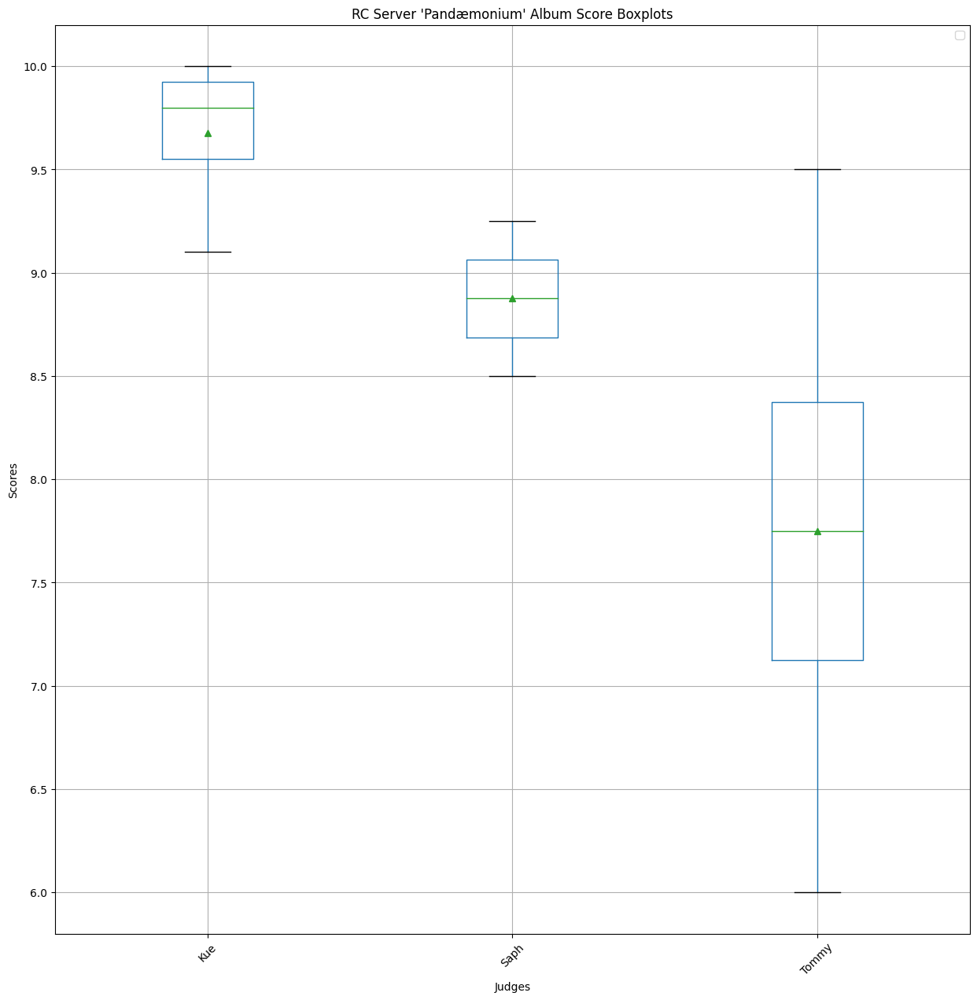
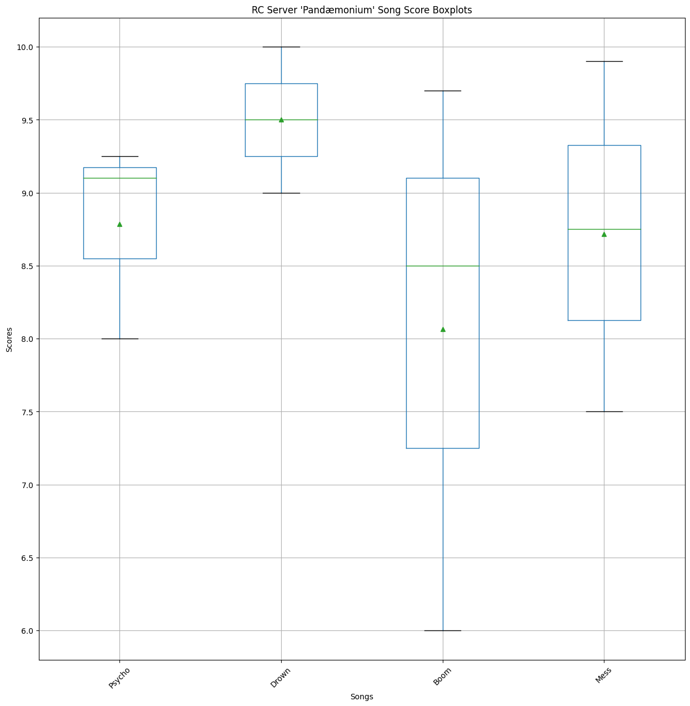
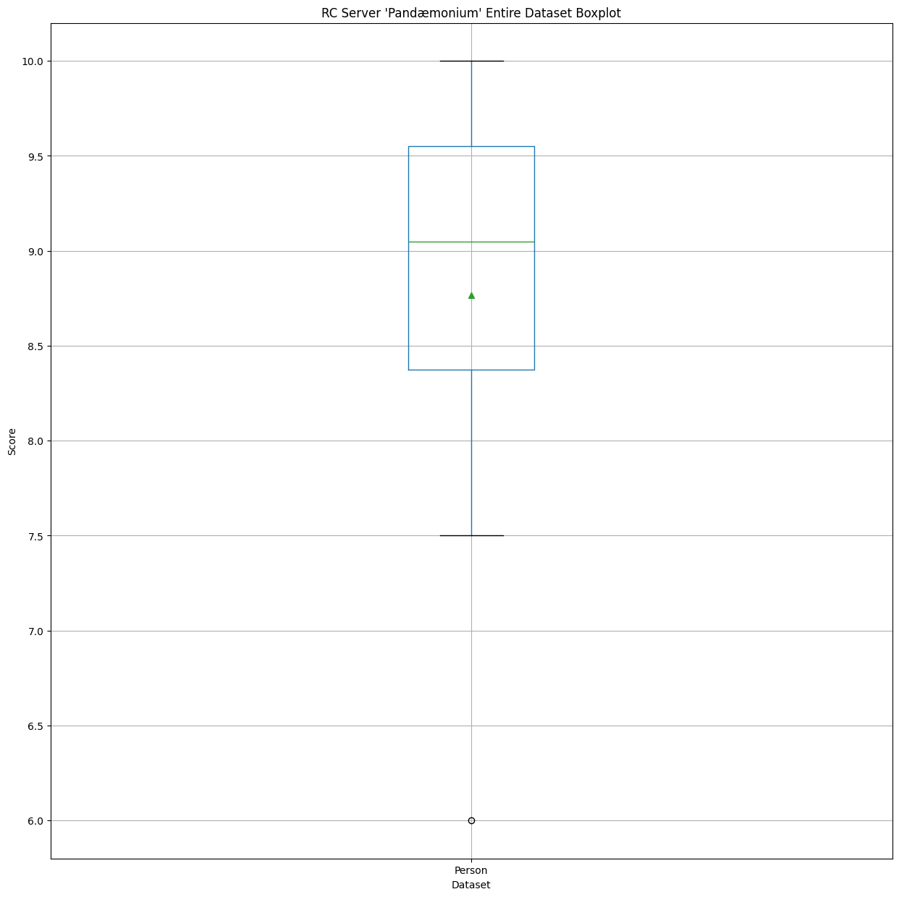
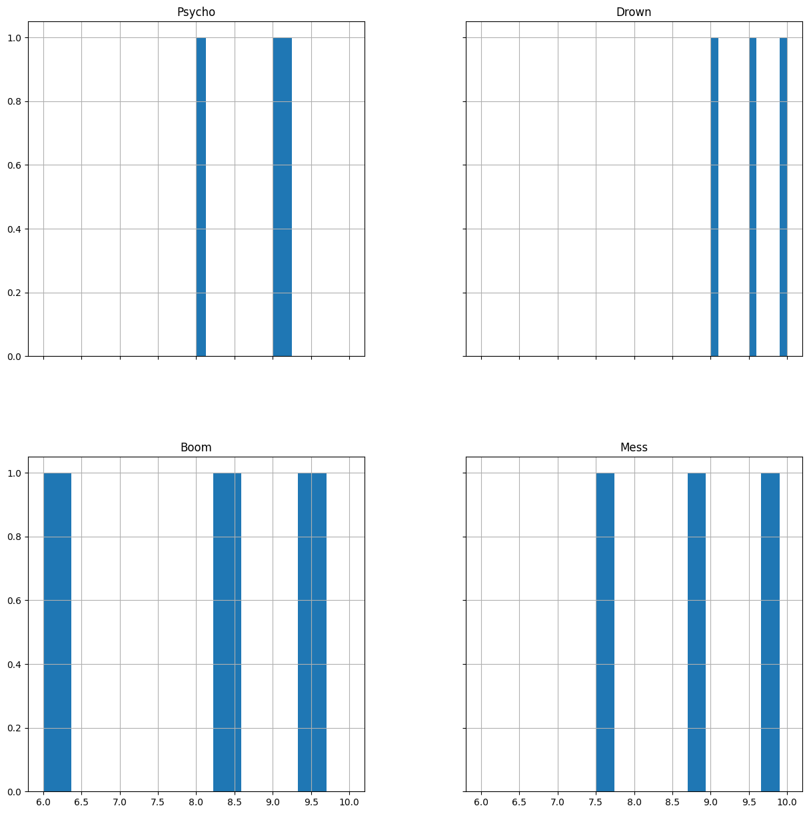

# Panadaemonium
Results for Pandaemonium!

Finally one that I've listened to!

# Raw Scores

<table border="1" class="dataframe"></table>
  <thead>
    <tr style="text-align: right;">
      <th></th>
      <th>Kue</th>
      <th>Saph</th>
      <th>Tommy</th>
    </tr>
    <tr>
      <th>Song</th>
      <th></th>
      <th></th>
      <th></th>
    </tr>
  </thead>
  <tbody>
    <tr>
      <th>Psycho</th>
      <td>9.10</td>
      <td>9.25</td>
      <td>8.00</td>
    </tr>
    <tr>
      <th>Drown</th>
      <td>10.00</td>
      <td>9.00</td>
      <td>9.50</td>
    </tr>
    <tr>
      <th>Boom</th>
      <td>9.70</td>
      <td>8.50</td>
      <td>6.00</td>
    </tr>
    <tr>
      <th>Mess</th>
      <td>9.90</td>
      <td>8.75</td>
      <td>7.50</td>
    </tr>
  </tbody>
</table>

# Data Description
## Person-wise

<table border="1" class="dataframe">
  <thead>
    <tr style="text-align: right;">
      <th></th>
      <th>Kue</th>
      <th>Saph</th>
      <th>Tommy</th>
    </tr>
  </thead>
  <tbody>
    <tr>
      <th>count</th>
      <td>4.00</td>
      <td>4.00</td>
      <td>4.00</td>
    </tr>
    <tr>
      <th>mean</th>
      <td>9.68</td>
      <td>8.88</td>
      <td>7.75</td>
    </tr>
    <tr>
      <th>std</th>
      <td>0.40</td>
      <td>0.32</td>
      <td>1.44</td>
    </tr>
    <tr>
      <th>min</th>
      <td>9.10</td>
      <td>8.50</td>
      <td>6.00</td>
    </tr>
    <tr>
      <th>25%</th>
      <td>9.55</td>
      <td>8.69</td>
      <td>7.12</td>
    </tr>
    <tr>
      <th>50%</th>
      <td>9.80</td>
      <td>8.88</td>
      <td>7.75</td>
    </tr>
    <tr>
      <th>75%</th>
      <td>9.93</td>
      <td>9.06</td>
      <td>8.38</td>
    </tr>
    <tr>
      <th>max</th>
      <td>10.00</td>
      <td>9.25</td>
      <td>9.50</td>
    </tr>
  </tbody>
</table>

## Song-wise

<table border="1" class="dataframe">
  <thead>
    <tr style="text-align: right;">
      <th>Song</th>
      <th>Psycho</th>
      <th>Drown</th>
      <th>Boom</th>
      <th>Mess</th>
    </tr>
  </thead>
  <tbody>
    <tr>
      <th>count</th>
      <td>3.00</td>
      <td>3.00</td>
      <td>3.00</td>
      <td>3.00</td>
    </tr>
    <tr>
      <th>mean</th>
      <td>8.78</td>
      <td>9.50</td>
      <td>8.07</td>
      <td>8.72</td>
    </tr>
    <tr>
      <th>std</th>
      <td>0.68</td>
      <td>0.50</td>
      <td>1.89</td>
      <td>1.20</td>
    </tr>
    <tr>
      <th>min</th>
      <td>8.00</td>
      <td>9.00</td>
      <td>6.00</td>
      <td>7.50</td>
    </tr>
    <tr>
      <th>25%</th>
      <td>8.55</td>
      <td>9.25</td>
      <td>7.25</td>
      <td>8.12</td>
    </tr>
    <tr>
      <th>50%</th>
      <td>9.10</td>
      <td>9.50</td>
      <td>8.50</td>
      <td>8.75</td>
    </tr>
    <tr>
      <th>75%</th>
      <td>9.18</td>
      <td>9.75</td>
      <td>9.10</td>
      <td>9.32</td>
    </tr>
    <tr>
      <th>max</th>
      <td>9.25</td>
      <td>10.00</td>
      <td>9.70</td>
      <td>9.90</td>
    </tr>
  </tbody>
</table>

## Entire dataset

<table border="1" class="dataframe">
  <thead>
    <tr style="text-align: right;">
      <th></th>
      <th>Person</th>
    </tr>
  </thead>
  <tbody>
    <tr>
      <th>count</th>
      <td>12.00</td>
    </tr>
    <tr>
      <th>mean</th>
      <td>8.77</td>
    </tr>
    <tr>
      <th>std</th>
      <td>1.15</td>
    </tr>
    <tr>
      <th>min</th>
      <td>6.00</td>
    </tr>
    <tr>
      <th>25%</th>
      <td>8.38</td>
    </tr>
    <tr>
      <th>50%</th>
      <td>9.05</td>
    </tr>
    <tr>
      <th>75%</th>
      <td>9.55</td>
    </tr>
    <tr>
      <th>max</th>
      <td>10.00</td>
    </tr>
  </tbody>
</table>

# Boxplots

## Person-wise

## Song-wise

## Entire dataset

# Histograms

## Person-wise

## Song-wise

## Entire dataset
