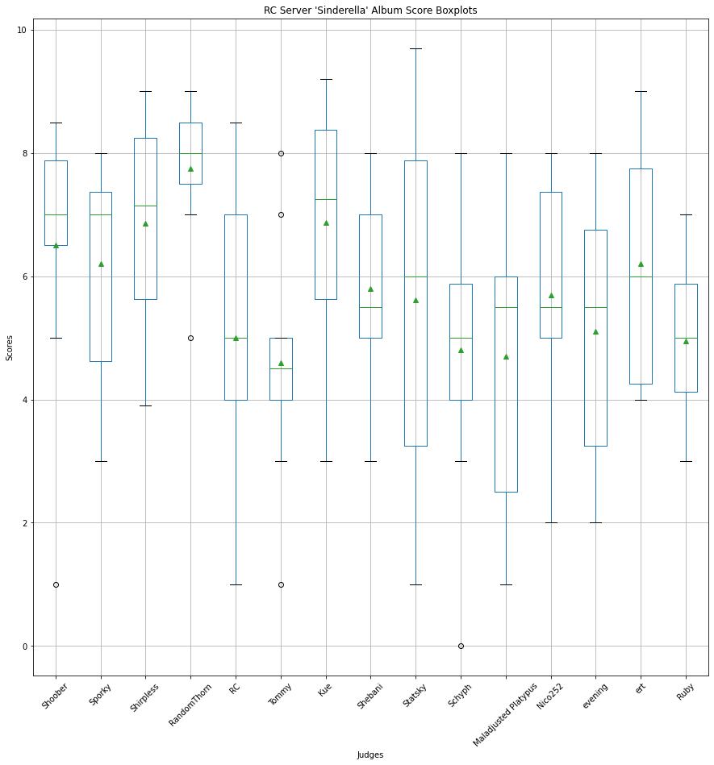

# Sinderella

Here are the result for Calliope Mori's *Sinderella*!

Thanks to all of the participants!

# Raw Scores

|Song|Shoober|Sporky|Shirpless|RandomThorn|RC|Tommy|Kue|Shebani|Statsky|Schyph|Maladjusted Platypus|Nico252|evening|ert|Ruby|
|-|-|-|-|-|-|-|-|-|-|-|-|-|-|-|-|
|Taste of Death|7.00|6.50|8.90|8.50|NaN|4|5.00|5|4.00|4.00|6|4.00|5|4|5.00|
|Wanted, Wasted|8.00|8.00|5.00|8.00|7.00|5|7.00|7|8.50|5.00|5|7.50|7|6|5.50|
|I’m Greedy|1.00|3.00|3.90|5.00|1.00|1|3.00|3|1.00|0.00|1|2.00|2|6|3.00|
|Internet Brain Rot|6.50|7.00|8.50|7.00|5.00|4|6.00|5|3.00|5.00|4|5.00|6|5|4.50|
|NEZUMI Scheme|7.50|7.00|5.50|7.50|4.00|5|8.50|8|6.00|6.00|6|7.00|4|8|6.00|
|soul food|7.00|4.00|6.90|7.50|7.00|5|9.00|6|6.00|3.00|6|5.00|3|7|4.00|
|CRINGECORE|6.50|7.50|7.40|8.00|4.00|4|7.50|4|3.00|5.50|2|6.00|3|4|5.00|
|Dance Past Midnight|8.00|7.00|6.00|8.50|6.00|8|8.00|7|9.70|7.50|7|7.50|7|9|6.00|
|Death Sentence|5.00|4.00|7.50|8.50|2.50|3|5.50|5|6.00|4.00|2|5.00|6|4|3.50|
|glass slipper|8.50|8.00|9.00|9.00|8.50|7|9.20|8|9.00|8.00|8|8.00|8|9|7.00|

# Data Description
## Person-wise

| |Shoober|Sporky|Shirpless|RandomThorn|RC|Tommy|Kue|Shebani|Statsky|Schyph|Maladjusted Platypus|Nico252|evening|ert|Ruby|
|-|-|-|-|-|-|-|-|-|-|-|-|-|-|-|-|
|count|10.00|10.00|10.00|10.00|9.00|10.00|10.00|10.00|10.00|10.00|10.00|10.00|10.00|10.00|10.00|
|mean|6.50|6.20|6.86|7.75|5.00|4.60|6.87|5.80|5.62|4.80|4.70|5.70|5.10|6.20|4.95|
|std|2.17|1.83|1.73|1.14|2.38|1.96|1.98|1.69|2.88|2.29|2.36|1.87|2.02|1.99|1.23|
|min|1.00|3.00|3.90|5.00|1.00|1.00|3.00|3.00|1.00|0.00|1.00|2.00|2.00|4.00|3.00|
|25%|6.50|4.62|5.62|7.50|4.00|4.00|5.62|5.00|3.25|4.00|2.50|5.00|3.25|4.25|4.12|
|50%|7.00|7.00|7.15|8.00|5.00|4.50|7.25|5.50|6.00|5.00|5.50|5.50|5.50|6.00|5.00|
|75%|7.88|7.38|8.25|8.50|7.00|5.00|8.38|7.00|7.88|5.88|6.00|7.38|6.75|7.75|5.88|
|max|8.50|8.00|9.00|9.00|8.50|8.00|9.20|8.00|9.70|8.00|8.00|8.00|8.00|9.00|7.00|

## Song-wise

| |Taste of Death|Wanted, Wasted|I’m Greedy|Internet Brain Rot|NEZUMI Scheme|soul food|CRINGECORE|Dance Past Midnight|Death Sentence|glass slipper|
|-|-|-|-|-|-|-|-|-|-|-|
|count|14.00|15.00|15.00|15.00|15.00|15.00|15.00|15.00|15.00|15.00|
|mean|5.49|6.63|2.39|5.43|6.40|5.76|5.16|7.48|4.77|8.28|
|std|1.67|1.27|1.68|1.41|1.40|1.74|1.92|1.09|1.78|0.70|
|min|4.00|5.00|0.00|3.00|4.00|3.00|2.00|6.00|2.00|7.00|
|25%|4.00|5.25|1.00|4.75|5.75|4.50|4.00|7.00|3.75|8.00|
|50%|5.00|7.00|2.00|5.00|6.00|6.00|5.00|7.50|5.00|8.00|
|75%|6.38|7.75|3.00|6.25|7.50|7.00|6.95|8.00|5.75|9.00|
|max|8.90|8.50|6.00|8.50|8.50|9.00|8.00|9.70|8.50|9.20|

## Entire dataset

```
count   149.00
mean      5.78
std       2.12
min       0.00
25%       4.00
50%       6.00
75%       7.50
max       9.70
dtype: float64
```

# Histograms
## Person-wise


## Songwise


## Entire dataset


# Boxplots
## Person-wise


## Person-wise (excluding outliers)


## Songwise
