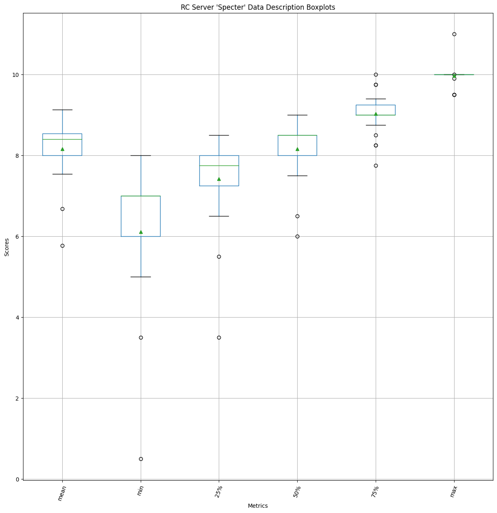
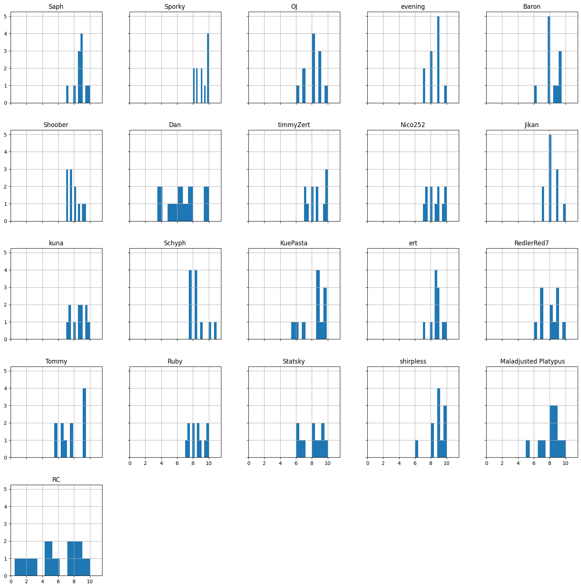
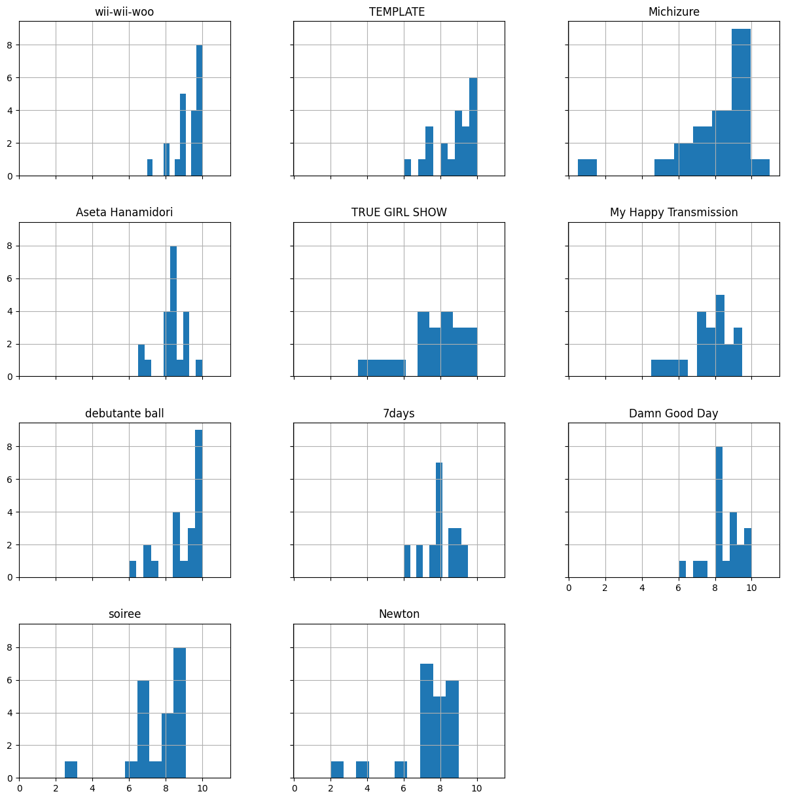

# Specter

Here are the results for Hoshimachi Suisei's *Specter*!

Thanks to all of the participants! This was fun to set up, so hopefully we can do this with more albums in the future.

# Raw Scores

<table border="1" class="dataframe">
  <thead>
    <tr style="text-align: right;">
      <th></th>
      <th>Saph</th>
      <th>Sporky</th>
      <th>OJ</th>
      <th>evening</th>
      <th>Baron</th>
      <th>Shoober</th>
      <th>Dan</th>
      <th>timmyZert</th>
      <th>Nico252</th>
      <th>Jikan</th>
      <th>kuna</th>
      <th>Schyph</th>
      <th>KuePasta</th>
      <th>ert</th>
      <th>RedlerRed7</th>
      <th>Tommy</th>
      <th>Ruby</th>
      <th>Statsky</th>
      <th>shirpless</th>
    </tr>
    <tr>
      <th>Song</th>
      <th></th>
      <th></th>
      <th></th>
      <th></th>
      <th></th>
      <th></th>
      <th></th>
      <th></th>
      <th></th>
      <th></th>
      <th></th>
      <th></th>
      <th></th>
      <th></th>
      <th></th>
      <th></th>
      <th></th>
      <th></th>
      <th></th>
    </tr>
  </thead>
  <tbody>
    <tr>
      <th>wii-wii-woo</th>
      <td>9.00</td>
      <td>9.50</td>
      <td>9</td>
      <td>8</td>
      <td>9.50</td>
      <td>9.00</td>
      <td>9.50</td>
      <td>10.00</td>
      <td>9.50</td>
      <td>8</td>
      <td>10.00</td>
      <td>10.00</td>
      <td>9.70</td>
      <td>9.00</td>
      <td>10.00</td>
      <td>9.50</td>
      <td>10.00</td>
      <td>7.00</td>
      <td>10.00</td>
    </tr>
    <tr>
      <th>TEMPLATE</th>
      <td>10.00</td>
      <td>10.00</td>
      <td>9</td>
      <td>9</td>
      <td>9.50</td>
      <td>8.50</td>
      <td>10.00</td>
      <td>10.00</td>
      <td>10.00</td>
      <td>9</td>
      <td>7.50</td>
      <td>7.50</td>
      <td>7.10</td>
      <td>10.00</td>
      <td>8.00</td>
      <td>8.00</td>
      <td>9.00</td>
      <td>6.00</td>
      <td>10.00</td>
    </tr>
    <tr>
      <th>Michizure</th>
      <td>8.50</td>
      <td>9.00</td>
      <td>9</td>
      <td>8</td>
      <td>9.00</td>
      <td>7.50</td>
      <td>6.50</td>
      <td>7.00</td>
      <td>7.50</td>
      <td>8</td>
      <td>9.00</td>
      <td>10.00</td>
      <td>6.20</td>
      <td>9.50</td>
      <td>9.00</td>
      <td>9.10</td>
      <td>9.50</td>
      <td>8.00</td>
      <td>9.80</td>
    </tr>
    <tr>
      <th>Aseta Hanamidori</th>
      <td>8.00</td>
      <td>10.00</td>
      <td>8</td>
      <td>8</td>
      <td>7.00</td>
      <td>7.00</td>
      <td>7.50</td>
      <td>8.50</td>
      <td>9.00</td>
      <td>9</td>
      <td>9.00</td>
      <td>8.50</td>
      <td>8.90</td>
      <td>8.50</td>
      <td>8.50</td>
      <td>7.00</td>
      <td>8.00</td>
      <td>8.50</td>
      <td>9.80</td>
    </tr>
    <tr>
      <th>TRUE GIRL SHOW</th>
      <td>9.00</td>
      <td>8.50</td>
      <td>7</td>
      <td>7</td>
      <td>8.00</td>
      <td>9.50</td>
      <td>7.00</td>
      <td>8.50</td>
      <td>8.00</td>
      <td>7</td>
      <td>8.50</td>
      <td>7.50</td>
      <td>9.80</td>
      <td>9.00</td>
      <td>7.00</td>
      <td>6.00</td>
      <td>8.50</td>
      <td>9.00</td>
      <td>10.00</td>
    </tr>
    <tr>
      <th>My Happy Transmission</th>
      <td>7.00</td>
      <td>8.50</td>
      <td>6</td>
      <td>7</td>
      <td>8.00</td>
      <td>7.50</td>
      <td>8.50</td>
      <td>7.50</td>
      <td>8.00</td>
      <td>9</td>
      <td>9.50</td>
      <td>7.50</td>
      <td>5.40</td>
      <td>8.50</td>
      <td>7.00</td>
      <td>6.50</td>
      <td>7.00</td>
      <td>9.50</td>
      <td>8.50</td>
    </tr>
    <tr>
      <th>debutante ball</th>
      <td>8.50</td>
      <td>10.00</td>
      <td>10</td>
      <td>10</td>
      <td>9.50</td>
      <td>7.00</td>
      <td>8.00</td>
      <td>9.50</td>
      <td>10.00</td>
      <td>10</td>
      <td>7.00</td>
      <td>8.50</td>
      <td>9.90</td>
      <td>8.50</td>
      <td>9.00</td>
      <td>8.50</td>
      <td>10.00</td>
      <td>10.00</td>
      <td>9.50</td>
    </tr>
    <tr>
      <th>7days</th>
      <td>9.00</td>
      <td>8.00</td>
      <td>7</td>
      <td>9</td>
      <td>7.00</td>
      <td>7.50</td>
      <td>8.00</td>
      <td>8.00</td>
      <td>7.50</td>
      <td>8</td>
      <td>8.00</td>
      <td>9.00</td>
      <td>8.40</td>
      <td>8.50</td>
      <td>8.00</td>
      <td>7.50</td>
      <td>8.50</td>
      <td>9.50</td>
      <td>8.50</td>
    </tr>
    <tr>
      <th>Damn Good Day</th>
      <td>9.50</td>
      <td>10.00</td>
      <td>8</td>
      <td>9</td>
      <td>7.00</td>
      <td>8.00</td>
      <td>7.50</td>
      <td>10.00</td>
      <td>9.00</td>
      <td>8</td>
      <td>9.50</td>
      <td>8.50</td>
      <td>8.70</td>
      <td>8.00</td>
      <td>7.00</td>
      <td>7.50</td>
      <td>8.00</td>
      <td>8.00</td>
      <td>10.00</td>
    </tr>
    <tr>
      <th>soiree</th>
      <td>9.00</td>
      <td>9.00</td>
      <td>8</td>
      <td>9</td>
      <td>8.00</td>
      <td>8.00</td>
      <td>7.50</td>
      <td>8.00</td>
      <td>8.50</td>
      <td>7</td>
      <td>8.50</td>
      <td>8.50</td>
      <td>9.20</td>
      <td>7.00</td>
      <td>6.00</td>
      <td>7.00</td>
      <td>7.50</td>
      <td>6.50</td>
      <td>9.50</td>
    </tr>
    <tr>
      <th>Newton</th>
      <td>8.50</td>
      <td>8.00</td>
      <td>8</td>
      <td>9</td>
      <td>9.00</td>
      <td>7.00</td>
      <td>7.00</td>
      <td>7.00</td>
      <td>7.00</td>
      <td>8</td>
      <td>7.50</td>
      <td>7.50</td>
      <td>9.68</td>
      <td>9.00</td>
      <td>9.00</td>
      <td>8.00</td>
      <td>7.50</td>
      <td>6.00</td>
      <td>10.00</td>
    </tr>
  </tbody>
</table>

# Data Description

## Person-wise

<table border="1" class="dataframe">
  <thead>
    <tr style="text-align: right;">
      <th></th>
      <th>Saph</th>
      <th>Sporky</th>
      <th>OJ</th>
      <th>evening</th>
      <th>Baron</th>
      <th>Shoober</th>
      <th>Dan</th>
      <th>timmyZert</th>
      <th>Nico252</th>
      <th>Jikan</th>
      <th>kuna</th>
      <th>Schyph</th>
      <th>KuePasta</th>
      <th>ert</th>
      <th>RedlerRed7</th>
      <th>Tommy</th>
      <th>Ruby</th>
      <th>Statsky</th>
      <th>shirpless</th>
    </tr>
  </thead>
  <tbody>
    <tr>
      <th>count</th>
      <td>11.00</td>
      <td>11.00</td>
      <td>11.00</td>
      <td>11.00</td>
      <td>11.00</td>
      <td>11.00</td>
      <td>11.00</td>
      <td>11.00</td>
      <td>11.00</td>
      <td>11.00</td>
      <td>11.00</td>
      <td>11.00</td>
      <td>11.00</td>
      <td>11.00</td>
      <td>11.00</td>
      <td>11.00</td>
      <td>11.00</td>
      <td>11.00</td>
      <td>11.00</td>
    </tr>
    <tr>
      <th>mean</th>
      <td>8.73</td>
      <td>9.14</td>
      <td>8.09</td>
      <td>8.45</td>
      <td>8.32</td>
      <td>7.86</td>
      <td>7.91</td>
      <td>8.55</td>
      <td>8.55</td>
      <td>8.27</td>
      <td>8.55</td>
      <td>8.45</td>
      <td>8.45</td>
      <td>8.68</td>
      <td>8.05</td>
      <td>7.69</td>
      <td>8.50</td>
      <td>8.00</td>
      <td>9.60</td>
    </tr>
    <tr>
      <th>std</th>
      <td>0.79</td>
      <td>0.81</td>
      <td>1.14</td>
      <td>0.93</td>
      <td>1.03</td>
      <td>0.84</td>
      <td>1.07</td>
      <td>1.17</td>
      <td>1.04</td>
      <td>0.90</td>
      <td>0.96</td>
      <td>0.93</td>
      <td>1.55</td>
      <td>0.78</td>
      <td>1.19</td>
      <td>1.07</td>
      <td>1.02</td>
      <td>1.45</td>
      <td>0.58</td>
    </tr>
    <tr>
      <th>min</th>
      <td>7.00</td>
      <td>8.00</td>
      <td>6.00</td>
      <td>7.00</td>
      <td>7.00</td>
      <td>7.00</td>
      <td>6.50</td>
      <td>7.00</td>
      <td>7.00</td>
      <td>7.00</td>
      <td>7.00</td>
      <td>7.50</td>
      <td>5.40</td>
      <td>7.00</td>
      <td>6.00</td>
      <td>6.00</td>
      <td>7.00</td>
      <td>6.00</td>
      <td>8.50</td>
    </tr>
    <tr>
      <th>25%</th>
      <td>8.50</td>
      <td>8.50</td>
      <td>7.50</td>
      <td>8.00</td>
      <td>7.50</td>
      <td>7.25</td>
      <td>7.25</td>
      <td>7.75</td>
      <td>7.75</td>
      <td>8.00</td>
      <td>7.75</td>
      <td>7.50</td>
      <td>7.75</td>
      <td>8.50</td>
      <td>7.00</td>
      <td>7.00</td>
      <td>7.75</td>
      <td>6.75</td>
      <td>9.50</td>
    </tr>
    <tr>
      <th>50%</th>
      <td>9.00</td>
      <td>9.00</td>
      <td>8.00</td>
      <td>9.00</td>
      <td>8.00</td>
      <td>7.50</td>
      <td>7.50</td>
      <td>8.50</td>
      <td>8.50</td>
      <td>8.00</td>
      <td>8.50</td>
      <td>8.50</td>
      <td>8.90</td>
      <td>8.50</td>
      <td>8.00</td>
      <td>7.50</td>
      <td>8.50</td>
      <td>8.00</td>
      <td>9.80</td>
    </tr>
    <tr>
      <th>75%</th>
      <td>9.00</td>
      <td>10.00</td>
      <td>9.00</td>
      <td>9.00</td>
      <td>9.25</td>
      <td>8.25</td>
      <td>8.25</td>
      <td>9.75</td>
      <td>9.25</td>
      <td>9.00</td>
      <td>9.25</td>
      <td>8.75</td>
      <td>9.69</td>
      <td>9.00</td>
      <td>9.00</td>
      <td>8.25</td>
      <td>9.25</td>
      <td>9.25</td>
      <td>10.00</td>
    </tr>
    <tr>
      <th>max</th>
      <td>10.00</td>
      <td>10.00</td>
      <td>10.00</td>
      <td>10.00</td>
      <td>9.50</td>
      <td>9.50</td>
      <td>10.00</td>
      <td>10.00</td>
      <td>10.00</td>
      <td>10.00</td>
      <td>10.00</td>
      <td>10.00</td>
      <td>9.90</td>
      <td>10.00</td>
      <td>10.00</td>
      <td>9.50</td>
      <td>10.00</td>
      <td>10.00</td>
      <td>10.00</td>
    </tr>
  </tbody>
</table>

## Song-wise

<table border="1" class="dataframe">
  <thead>
    <tr style="text-align: right;">
      <th>Song</th>
      <th>wii-wii-woo</th>
      <th>TEMPLATE</th>
      <th>Michizure</th>
      <th>Aseta Hanamidori</th>
      <th>TRUE GIRL SHOW</th>
      <th>My Happy Transmission</th>
      <th>debutante ball</th>
      <th>7days</th>
      <th>Damn Good Day</th>
      <th>soiree</th>
      <th>Newton</th>
    </tr>
  </thead>
  <tbody>
    <tr>
      <th>count</th>
      <td>19.00</td>
      <td>19.00</td>
      <td>19.00</td>
      <td>19.00</td>
      <td>19.00</td>
      <td>19.00</td>
      <td>19.00</td>
      <td>19.00</td>
      <td>19.00</td>
      <td>19.00</td>
      <td>19.00</td>
    </tr>
    <tr>
      <th>mean</th>
      <td>9.27</td>
      <td>8.85</td>
      <td>8.43</td>
      <td>8.35</td>
      <td>8.15</td>
      <td>7.71</td>
      <td>9.13</td>
      <td>8.15</td>
      <td>8.48</td>
      <td>7.98</td>
      <td>8.04</td>
    </tr>
    <tr>
      <th>std</th>
      <td>0.83</td>
      <td>1.21</td>
      <td>1.10</td>
      <td>0.86</td>
      <td>1.11</td>
      <td>1.12</td>
      <td>1.01</td>
      <td>0.69</td>
      <td>0.98</td>
      <td>0.98</td>
      <td>1.05</td>
    </tr>
    <tr>
      <th>min</th>
      <td>7.00</td>
      <td>6.00</td>
      <td>6.20</td>
      <td>7.00</td>
      <td>6.00</td>
      <td>5.40</td>
      <td>7.00</td>
      <td>7.00</td>
      <td>7.00</td>
      <td>6.00</td>
      <td>6.00</td>
    </tr>
    <tr>
      <th>25%</th>
      <td>9.00</td>
      <td>8.00</td>
      <td>7.75</td>
      <td>8.00</td>
      <td>7.00</td>
      <td>7.00</td>
      <td>8.50</td>
      <td>7.75</td>
      <td>8.00</td>
      <td>7.25</td>
      <td>7.25</td>
    </tr>
    <tr>
      <th>50%</th>
      <td>9.50</td>
      <td>9.00</td>
      <td>9.00</td>
      <td>8.50</td>
      <td>8.50</td>
      <td>7.50</td>
      <td>9.50</td>
      <td>8.00</td>
      <td>8.00</td>
      <td>8.00</td>
      <td>8.00</td>
    </tr>
    <tr>
      <th>75%</th>
      <td>10.00</td>
      <td>10.00</td>
      <td>9.05</td>
      <td>8.95</td>
      <td>9.00</td>
      <td>8.50</td>
      <td>10.00</td>
      <td>8.50</td>
      <td>9.25</td>
      <td>8.75</td>
      <td>9.00</td>
    </tr>
    <tr>
      <th>max</th>
      <td>10.00</td>
      <td>10.00</td>
      <td>10.00</td>
      <td>10.00</td>
      <td>10.00</td>
      <td>9.50</td>
      <td>10.00</td>
      <td>9.50</td>
      <td>10.00</td>
      <td>9.50</td>
      <td>10.00</td>
    </tr>
  </tbody>
</table>

## Entire dataset

<table border="1" class="dataframe">
  <thead>
    <tr style="text-align: right;">
      <th></th>
      <th>0</th>
    </tr>
  </thead>
  <tbody>
    <tr>
      <th>count</th>
      <td>209.00</td>
    </tr>
    <tr>
      <th>mean</th>
      <td>8.41</td>
    </tr>
    <tr>
      <th>std</th>
      <td>1.09</td>
    </tr>
    <tr>
      <th>min</th>
      <td>5.40</td>
    </tr>
    <tr>
      <th>25%</th>
      <td>7.50</td>
    </tr>
    <tr>
      <th>50%</th>
      <td>8.50</td>
    </tr>
    <tr>
      <th>75%</th>
      <td>9.10</td>
    </tr>
    <tr>
      <th>max</th>
      <td>10.00</td>
    </tr>
  </tbody>
</table>

# Boxplots
## Person-wise

## Song-wise

## Entire dataset

# Histograms

## Person-wise

## Song-wise

## Entire dataset
