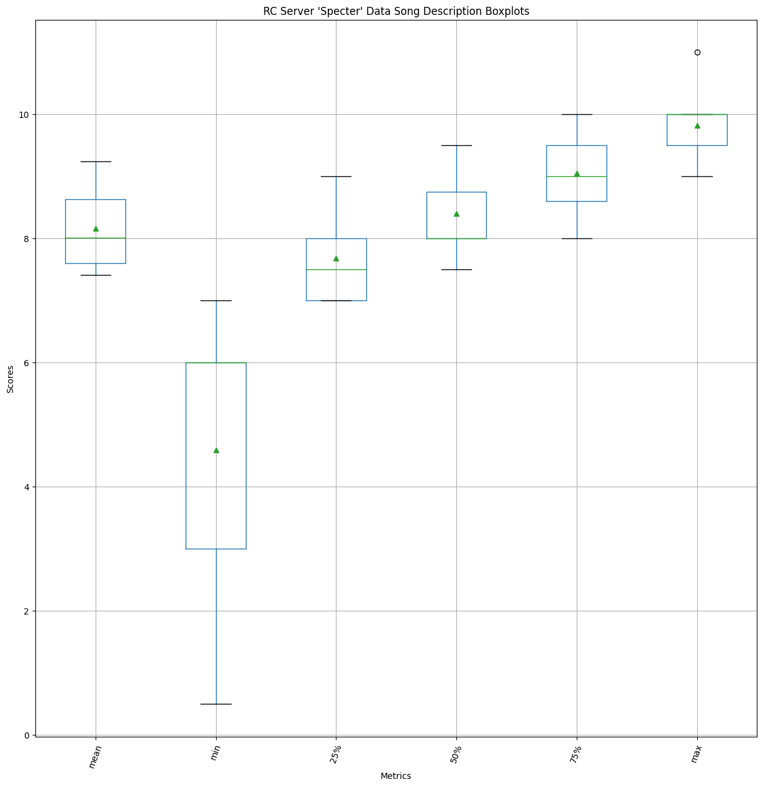
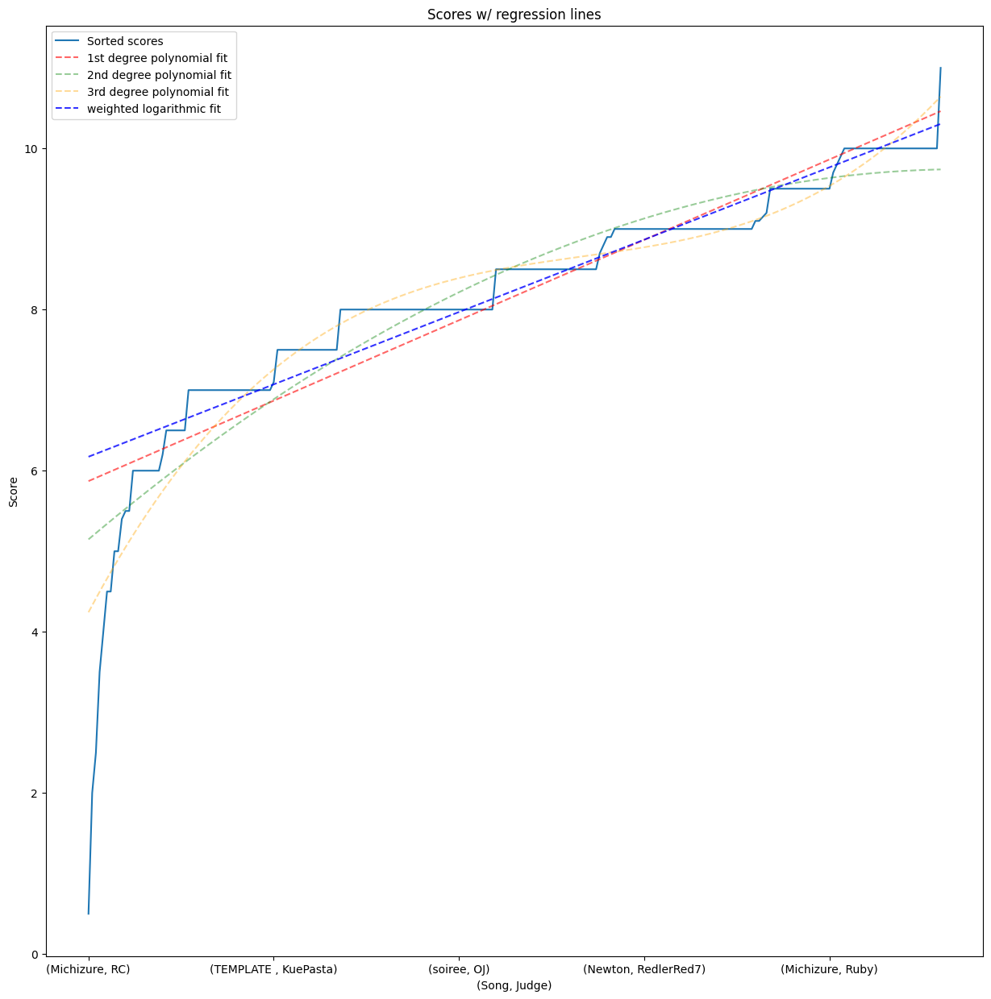
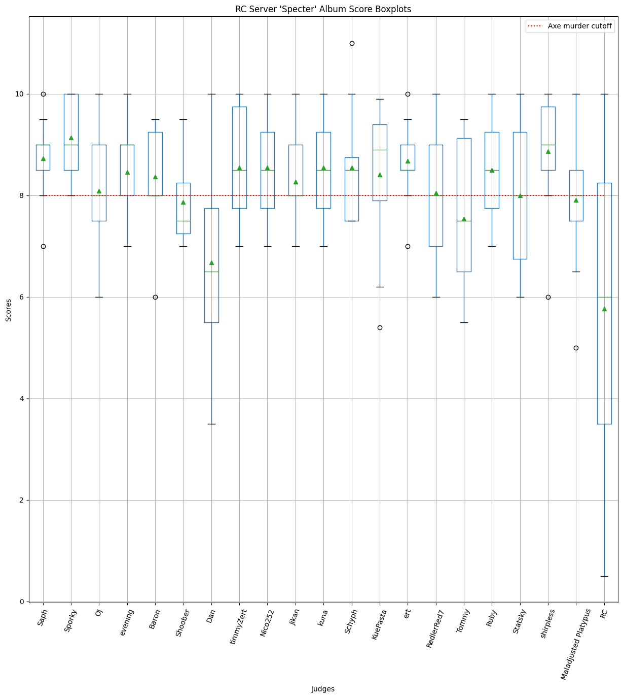
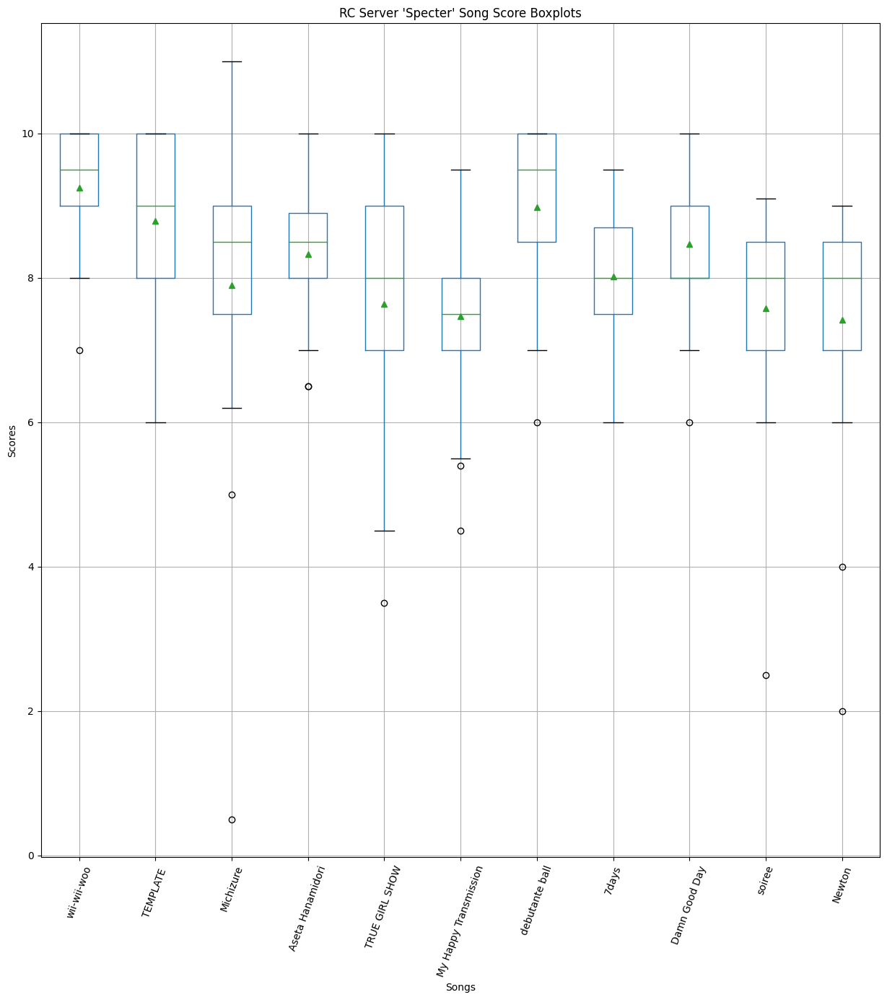
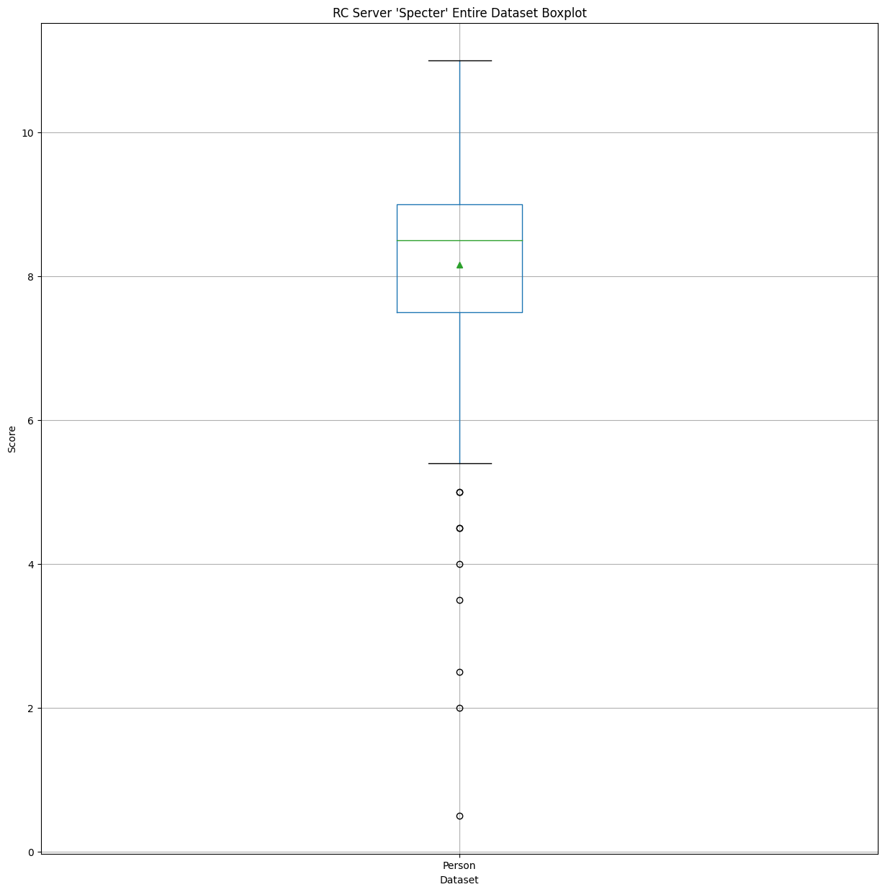
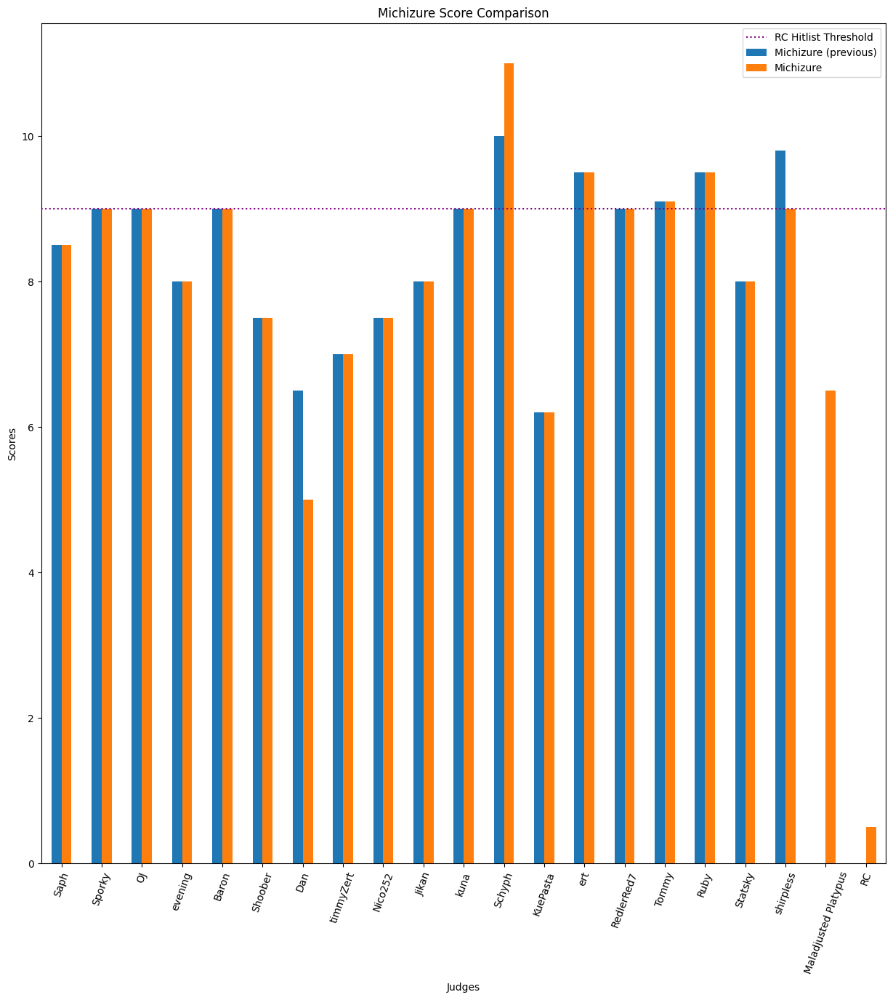
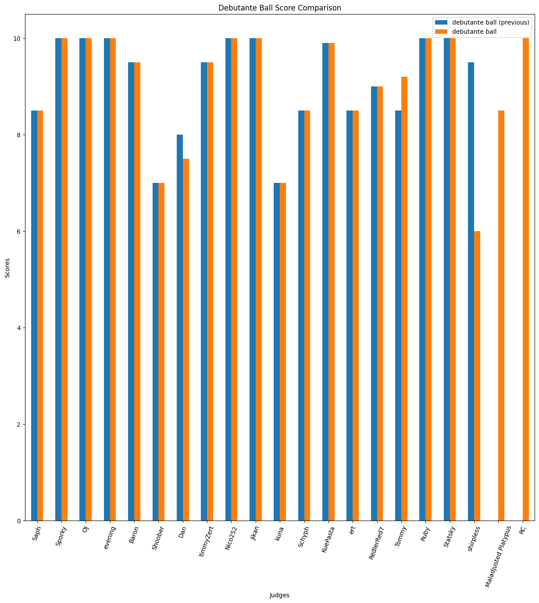
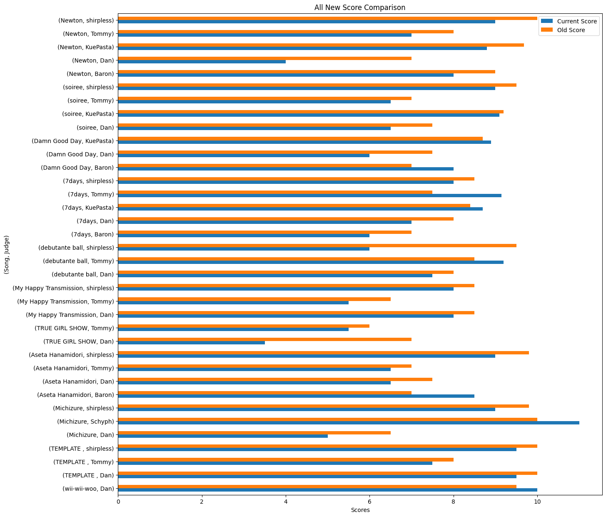

# Specter
Here are the results for Hoshimachi Suisei's *Specter*!

Thanks to all of the participants! This was fun to set up, so hopefully we can do this with more albums in the future.

# Raw Scores

<table border="1" class="dataframe">
  <thead>
    <tr style="text-align: right;">
      <th></th>
      <th>Saph</th>
      <th>Sporky</th>
      <th>OJ</th>
      <th>evening</th>
      <th>Baron</th>
      <th>Shoober</th>
      <th>Dan</th>
      <th>timmyZert</th>
      <th>Nico252</th>
      <th>Jikan</th>
      <th>kuna</th>
      <th>Schyph</th>
      <th>KuePasta</th>
      <th>ert</th>
      <th>RedlerRed7</th>
      <th>Tommy</th>
      <th>Ruby</th>
      <th>Statsky</th>
      <th>shirpless</th>
      <th>Maladjusted Platypus</th>
    </tr>
    <tr>
      <th>Song</th>
      <th></th>
      <th></th>
      <th></th>
      <th></th>
      <th></th>
      <th></th>
      <th></th>
      <th></th>
      <th></th>
      <th></th>
      <th></th>
      <th></th>
      <th></th>
      <th></th>
      <th></th>
      <th></th>
      <th></th>
      <th></th>
      <th></th>
      <th></th>
    </tr>
  </thead>
  <tbody>
    <tr>
      <th>wii-wii-woo</th>
      <td>9.00</td>
      <td>9.50</td>
      <td>9</td>
      <td>8</td>
      <td>9.50</td>
      <td>9.00</td>
      <td>10.00</td>
      <td>10.00</td>
      <td>9.50</td>
      <td>8</td>
      <td>10.00</td>
      <td>10.00</td>
      <td>9.70</td>
      <td>9.00</td>
      <td>10.00</td>
      <td>9.50</td>
      <td>10.00</td>
      <td>7.00</td>
      <td>10.00</td>
      <td>8.50</td>
    </tr>
    <tr>
      <th>TEMPLATE</th>
      <td>10.00</td>
      <td>10.00</td>
      <td>9</td>
      <td>9</td>
      <td>9.50</td>
      <td>8.50</td>
      <td>9.50</td>
      <td>10.00</td>
      <td>10.00</td>
      <td>9</td>
      <td>7.50</td>
      <td>7.50</td>
      <td>7.10</td>
      <td>10.00</td>
      <td>8.00</td>
      <td>7.50</td>
      <td>9.00</td>
      <td>6.00</td>
      <td>9.50</td>
      <td>10.00</td>
    </tr>
    <tr>
      <th>Michizure</th>
      <td>8.50</td>
      <td>9.00</td>
      <td>9</td>
      <td>8</td>
      <td>9.00</td>
      <td>7.50</td>
      <td>5.00</td>
      <td>7.00</td>
      <td>7.50</td>
      <td>8</td>
      <td>9.00</td>
      <td>11.00</td>
      <td>6.20</td>
      <td>9.50</td>
      <td>9.00</td>
      <td>9.10</td>
      <td>9.50</td>
      <td>8.00</td>
      <td>9.00</td>
      <td>6.50</td>
    </tr>
    <tr>
      <th>Aseta Hanamidori</th>
      <td>8.00</td>
      <td>10.00</td>
      <td>8</td>
      <td>8</td>
      <td>8.50</td>
      <td>7.00</td>
      <td>6.50</td>
      <td>8.50</td>
      <td>9.00</td>
      <td>9</td>
      <td>9.00</td>
      <td>8.50</td>
      <td>8.90</td>
      <td>8.50</td>
      <td>8.50</td>
      <td>6.50</td>
      <td>8.00</td>
      <td>8.50</td>
      <td>9.00</td>
      <td>8.50</td>
    </tr>
    <tr>
      <th>TRUE GIRL SHOW</th>
      <td>9.00</td>
      <td>8.50</td>
      <td>7</td>
      <td>7</td>
      <td>8.00</td>
      <td>9.50</td>
      <td>3.50</td>
      <td>8.50</td>
      <td>8.00</td>
      <td>7</td>
      <td>8.50</td>
      <td>7.50</td>
      <td>9.80</td>
      <td>9.00</td>
      <td>7.00</td>
      <td>5.50</td>
      <td>8.50</td>
      <td>9.00</td>
      <td>10.00</td>
      <td>5.00</td>
    </tr>
    <tr>
      <th>My Happy Transmission</th>
      <td>7.00</td>
      <td>8.50</td>
      <td>6</td>
      <td>7</td>
      <td>8.00</td>
      <td>7.50</td>
      <td>8.00</td>
      <td>7.50</td>
      <td>8.00</td>
      <td>9</td>
      <td>9.50</td>
      <td>7.50</td>
      <td>5.40</td>
      <td>8.50</td>
      <td>7.00</td>
      <td>5.50</td>
      <td>7.00</td>
      <td>9.50</td>
      <td>8.00</td>
      <td>8.00</td>
    </tr>
    <tr>
      <th>debutante ball</th>
      <td>8.50</td>
      <td>10.00</td>
      <td>10</td>
      <td>10</td>
      <td>9.50</td>
      <td>7.00</td>
      <td>7.50</td>
      <td>9.50</td>
      <td>10.00</td>
      <td>10</td>
      <td>7.00</td>
      <td>8.50</td>
      <td>9.90</td>
      <td>8.50</td>
      <td>9.00</td>
      <td>9.20</td>
      <td>10.00</td>
      <td>10.00</td>
      <td>6.00</td>
      <td>8.50</td>
    </tr>
    <tr>
      <th>7days</th>
      <td>9.00</td>
      <td>8.00</td>
      <td>7</td>
      <td>9</td>
      <td>6.00</td>
      <td>7.50</td>
      <td>7.00</td>
      <td>8.00</td>
      <td>7.50</td>
      <td>8</td>
      <td>8.00</td>
      <td>9.00</td>
      <td>8.70</td>
      <td>8.50</td>
      <td>8.00</td>
      <td>8.80</td>
      <td>8.50</td>
      <td>9.50</td>
      <td>8.00</td>
      <td>8.00</td>
    </tr>
    <tr>
      <th>Damn Good Day</th>
      <td>9.50</td>
      <td>10.00</td>
      <td>8</td>
      <td>9</td>
      <td>8.00</td>
      <td>8.00</td>
      <td>6.00</td>
      <td>10.00</td>
      <td>9.00</td>
      <td>8</td>
      <td>9.50</td>
      <td>8.50</td>
      <td>8.90</td>
      <td>8.00</td>
      <td>7.00</td>
      <td>7.50</td>
      <td>8.00</td>
      <td>8.00</td>
      <td>10.00</td>
      <td>9.00</td>
    </tr>
    <tr>
      <th>soiree</th>
      <td>9.00</td>
      <td>9.00</td>
      <td>8</td>
      <td>9</td>
      <td>8.00</td>
      <td>8.00</td>
      <td>6.50</td>
      <td>8.00</td>
      <td>8.50</td>
      <td>7</td>
      <td>8.50</td>
      <td>8.50</td>
      <td>9.10</td>
      <td>7.00</td>
      <td>6.00</td>
      <td>6.50</td>
      <td>7.50</td>
      <td>6.50</td>
      <td>9.00</td>
      <td>7.00</td>
    </tr>
    <tr>
      <th>Newton</th>
      <td>8.50</td>
      <td>8.00</td>
      <td>8</td>
      <td>9</td>
      <td>8.00</td>
      <td>7.00</td>
      <td>4.00</td>
      <td>7.00</td>
      <td>7.00</td>
      <td>8</td>
      <td>7.50</td>
      <td>7.50</td>
      <td>8.80</td>
      <td>9.00</td>
      <td>9.00</td>
      <td>7.00</td>
      <td>7.50</td>
      <td>6.00</td>
      <td>9.00</td>
      <td>8.00</td>
    </tr>
  </tbody>
</table>

# Data Description

## Person-wise

<table border="1" class="dataframe">
  <thead>
    <tr style="text-align: right;">
      <th></th>
      <th>Saph</th>
      <th>Sporky</th>
      <th>OJ</th>
      <th>evening</th>
      <th>Baron</th>
      <th>Shoober</th>
      <th>Dan</th>
      <th>timmyZert</th>
      <th>Nico252</th>
      <th>Jikan</th>
      <th>kuna</th>
      <th>Schyph</th>
      <th>KuePasta</th>
      <th>ert</th>
      <th>RedlerRed7</th>
      <th>Tommy</th>
      <th>Ruby</th>
      <th>Statsky</th>
      <th>shirpless</th>
      <th>Maladjusted Platypus</th>
    </tr>
  </thead>
  <tbody>
    <tr>
      <th>count</th>
      <td>11.00</td>
      <td>11.00</td>
      <td>11.00</td>
      <td>11.00</td>
      <td>11.00</td>
      <td>11.00</td>
      <td>11.00</td>
      <td>11.00</td>
      <td>11.00</td>
      <td>11.00</td>
      <td>11.00</td>
      <td>11.00</td>
      <td>11.00</td>
      <td>11.00</td>
      <td>11.00</td>
      <td>11.00</td>
      <td>11.00</td>
      <td>11.00</td>
      <td>11.00</td>
      <td>11.00</td>
    </tr>
    <tr>
      <th>mean</th>
      <td>8.73</td>
      <td>9.14</td>
      <td>8.09</td>
      <td>8.45</td>
      <td>8.36</td>
      <td>7.86</td>
      <td>6.68</td>
      <td>8.55</td>
      <td>8.55</td>
      <td>8.27</td>
      <td>8.55</td>
      <td>8.55</td>
      <td>8.41</td>
      <td>8.68</td>
      <td>8.05</td>
      <td>7.51</td>
      <td>8.50</td>
      <td>8.00</td>
      <td>8.86</td>
      <td>7.91</td>
    </tr>
    <tr>
      <th>std</th>
      <td>0.79</td>
      <td>0.81</td>
      <td>1.14</td>
      <td>0.93</td>
      <td>1.03</td>
      <td>0.84</td>
      <td>2.05</td>
      <td>1.17</td>
      <td>1.04</td>
      <td>0.90</td>
      <td>0.96</td>
      <td>1.13</td>
      <td>1.51</td>
      <td>0.78</td>
      <td>1.19</td>
      <td>1.46</td>
      <td>1.02</td>
      <td>1.45</td>
      <td>1.19</td>
      <td>1.34</td>
    </tr>
    <tr>
      <th>min</th>
      <td>7.00</td>
      <td>8.00</td>
      <td>6.00</td>
      <td>7.00</td>
      <td>6.00</td>
      <td>7.00</td>
      <td>3.50</td>
      <td>7.00</td>
      <td>7.00</td>
      <td>7.00</td>
      <td>7.00</td>
      <td>7.50</td>
      <td>5.40</td>
      <td>7.00</td>
      <td>6.00</td>
      <td>5.50</td>
      <td>7.00</td>
      <td>6.00</td>
      <td>6.00</td>
      <td>5.00</td>
    </tr>
    <tr>
      <th>25%</th>
      <td>8.50</td>
      <td>8.50</td>
      <td>7.50</td>
      <td>8.00</td>
      <td>8.00</td>
      <td>7.25</td>
      <td>5.50</td>
      <td>7.75</td>
      <td>7.75</td>
      <td>8.00</td>
      <td>7.75</td>
      <td>7.50</td>
      <td>7.90</td>
      <td>8.50</td>
      <td>7.00</td>
      <td>6.50</td>
      <td>7.75</td>
      <td>6.75</td>
      <td>8.50</td>
      <td>7.50</td>
    </tr>
    <tr>
      <th>50%</th>
      <td>9.00</td>
      <td>9.00</td>
      <td>8.00</td>
      <td>9.00</td>
      <td>8.00</td>
      <td>7.50</td>
      <td>6.50</td>
      <td>8.50</td>
      <td>8.50</td>
      <td>8.00</td>
      <td>8.50</td>
      <td>8.50</td>
      <td>8.90</td>
      <td>8.50</td>
      <td>8.00</td>
      <td>7.50</td>
      <td>8.50</td>
      <td>8.00</td>
      <td>9.00</td>
      <td>8.00</td>
    </tr>
    <tr>
      <th>75%</th>
      <td>9.00</td>
      <td>10.00</td>
      <td>9.00</td>
      <td>9.00</td>
      <td>9.25</td>
      <td>8.25</td>
      <td>7.75</td>
      <td>9.75</td>
      <td>9.25</td>
      <td>9.00</td>
      <td>9.25</td>
      <td>8.75</td>
      <td>9.40</td>
      <td>9.00</td>
      <td>9.00</td>
      <td>8.95</td>
      <td>9.25</td>
      <td>9.25</td>
      <td>9.75</td>
      <td>8.50</td>
    </tr>
    <tr>
      <th>max</th>
      <td>10.00</td>
      <td>10.00</td>
      <td>10.00</td>
      <td>10.00</td>
      <td>9.50</td>
      <td>9.50</td>
      <td>10.00</td>
      <td>10.00</td>
      <td>10.00</td>
      <td>10.00</td>
      <td>10.00</td>
      <td>11.00</td>
      <td>9.90</td>
      <td>10.00</td>
      <td>10.00</td>
      <td>9.50</td>
      <td>10.00</td>
      <td>10.00</td>
      <td>10.00</td>
      <td>10.00</td>
    </tr>
  </tbody>
</table>

## Song-wise

<table border="1" class="dataframe">
  <thead>
    <tr style="text-align: right;">
      <th>Song</th>
      <th>wii-wii-woo</th>
      <th>TEMPLATE</th>
      <th>Michizure</th>
      <th>Aseta Hanamidori</th>
      <th>TRUE GIRL SHOW</th>
      <th>My Happy Transmission</th>
      <th>debutante ball</th>
      <th>7days</th>
      <th>Damn Good Day</th>
      <th>soiree</th>
      <th>Newton</th>
    </tr>
  </thead>
  <tbody>
    <tr>
      <th>count</th>
      <td>20.00</td>
      <td>20.00</td>
      <td>20.00</td>
      <td>20.00</td>
      <td>20.00</td>
      <td>20.00</td>
      <td>20.00</td>
      <td>20.00</td>
      <td>20.00</td>
      <td>20.00</td>
      <td>20.00</td>
    </tr>
    <tr>
      <th>mean</th>
      <td>9.26</td>
      <td>8.83</td>
      <td>8.27</td>
      <td>8.32</td>
      <td>7.79</td>
      <td>7.62</td>
      <td>8.93</td>
      <td>8.10</td>
      <td>8.50</td>
      <td>7.83</td>
      <td>7.69</td>
    </tr>
    <tr>
      <th>std</th>
      <td>0.84</td>
      <td>1.19</td>
      <td>1.37</td>
      <td>0.86</td>
      <td>1.66</td>
      <td>1.14</td>
      <td>1.22</td>
      <td>0.83</td>
      <td>1.05</td>
      <td>1.01</td>
      <td>1.21</td>
    </tr>
    <tr>
      <th>min</th>
      <td>7.00</td>
      <td>6.00</td>
      <td>5.00</td>
      <td>6.50</td>
      <td>3.50</td>
      <td>5.40</td>
      <td>6.00</td>
      <td>6.00</td>
      <td>6.00</td>
      <td>6.00</td>
      <td>4.00</td>
    </tr>
    <tr>
      <th>25%</th>
      <td>9.00</td>
      <td>7.88</td>
      <td>7.50</td>
      <td>8.00</td>
      <td>7.00</td>
      <td>7.00</td>
      <td>8.50</td>
      <td>7.88</td>
      <td>8.00</td>
      <td>7.00</td>
      <td>7.00</td>
    </tr>
    <tr>
      <th>50%</th>
      <td>9.50</td>
      <td>9.00</td>
      <td>8.75</td>
      <td>8.50</td>
      <td>8.25</td>
      <td>7.75</td>
      <td>9.35</td>
      <td>8.00</td>
      <td>8.25</td>
      <td>8.00</td>
      <td>8.00</td>
    </tr>
    <tr>
      <th>75%</th>
      <td>10.00</td>
      <td>10.00</td>
      <td>9.00</td>
      <td>8.93</td>
      <td>9.00</td>
      <td>8.12</td>
      <td>10.00</td>
      <td>8.72</td>
      <td>9.12</td>
      <td>8.62</td>
      <td>8.57</td>
    </tr>
    <tr>
      <th>max</th>
      <td>10.00</td>
      <td>10.00</td>
      <td>11.00</td>
      <td>10.00</td>
      <td>10.00</td>
      <td>9.50</td>
      <td>10.00</td>
      <td>9.50</td>
      <td>10.00</td>
      <td>9.10</td>
      <td>9.00</td>
    </tr>
  </tbody>
</table>

## Entire dataset

<table border="1" class="dataframe">
  <thead>
    <tr style="text-align: right;">
      <th></th>
      <th>Person</th>
    </tr>
  </thead>
  <tbody>
    <tr>
      <th>count</th>
      <td>220.00</td>
    </tr>
    <tr>
      <th>mean</th>
      <td>8.28</td>
    </tr>
    <tr>
      <th>std</th>
      <td>1.24</td>
    </tr>
    <tr>
      <th>min</th>
      <td>3.50</td>
    </tr>
    <tr>
      <th>25%</th>
      <td>7.50</td>
    </tr>
    <tr>
      <th>50%</th>
      <td>8.50</td>
    </tr>
    <tr>
      <th>75%</th>
      <td>9.00</td>
    </tr>
    <tr>
      <th>max</th>
      <td>11.00</td>
    </tr>
  </tbody>
</table>

### Regressions
Good shout on this one Red. It was  interesting to align all of the scores and try and fit some lines to 'em

# Boxplots
Here is *Tommy's quick guide to box and whisker plots*:
- Top and bottom horizontal lines represent the min and max values
  - Also known as *whiskers*
- Green horizontal line is the median
- Horizontal lines that are the top and bottom edges of the box are the medians of the top and bottom 50% of the data respectively
- Green triangle is the mean
- Circles are outliers
  - A point is classified as an outlier (in this case) if they are further than 1.5x the interquartile range away from the box edge
  - The interquartile range is the difference between the medians of the top and bottom 50% of the data
    - AKA, the vertical length of the box!
- Segments separated by horizontal lines represent 25% of the dataset
  - e.g. if the bottom whisker is at 6, and the bottom edge of the box is at 7.5, 25% of the data has a value between 6 and 7.5
  - Therefore, the entire 'box' is the middle 50% of the data!
- If your scores are below the red line, you're dead
  - o7
- If your scores are *above* the purple line, you're dead
  - o7
## Person-wise

## Song-wise

## Entire dataset

# Histograms

## Person-wise

## Song-wise

## Entire dataset

# First Impressions vs Rescore

I've still got the old scores, so here are some comparisons:

## Michizure

## Debutante Ball

# All First Impressions vs Rescores
The more differences build up, the larger these ones will be!

